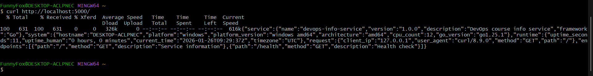
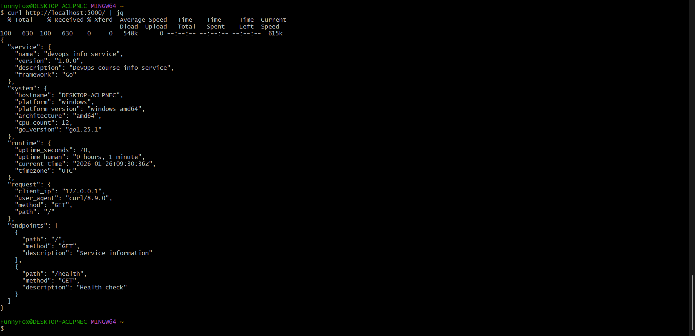

# DevOps Info Service (Go)

A compiled language implementation of the DevOps Info Service, built with Go.

## Overview

This is the Go version of the DevOps Info Service, providing the same functionality as the Python version but compiled to a single binary executable.

## Prerequisites

- **Go**: 1.21 or higher
- **Git**: Version control

## Installation
1) **Clone the repo**:
```bash
git clone https://github.com/FunnyFoXD/DevOps-Core-Course.git # HTTPS
# or
git clone git@github.com:FunnyFoXD/DevOps-Core-Course.git # SSH

# Go in the directory
cd app_go

# Download packages
go mod download
```

## Build Process

### Development Build

Simple build without optimizations:
```bash
go build -o devops-info-service main.go
```
**Output:**
- Creates `devops-info-service` (Linux/Mac) or `devops-info-service.exe` (Windows)
- Binary size: ~8-12 MB (includes debug symbols)

### Production Build (Optimized)

Build with optimizations to reduce binary size:

#### Linux/Mac
```bash
go build -ldflags="-s -w" -o devops-info-service main.go
```

#### Windows
```bash
go build -ldflags="-s -w" -o devops-info-service.exe main.go
```

**Flags explanation:**
- `-ldflags="-s -w"`: Strips debug information and reduces binary size
  - `-s`: Omit symbol table and debug information
  - `-w`: Omit DWARF symbol table

**Output:**
- Optimized binary size: ~5-7 MB
- No debug symbols (smaller, but harder to debug)

### Build Steps Breakdown

1. **Compile source code**:
```bash
go build main.go
```
   
2. **Check binary size**:
```bash
# Linux/Mac
ls -lh devops-info-service

# Windows
dir devops-info-service.exe
3. **Verify binary works**:

./devops-info-service
# or
devops-info-service.exe
```
### Cross-Platform Builds

Build for different platforms:
```bash
# Linux (amd64)
GOOS=linux GOARCH=amd64 go build -ldflags="-s -w" -o devops-info-service-linux main.go

# Windows (amd64)
GOOS=windows GOARCH=amd64 go build -ldflags="-s -w" -o devops-info-service-windows.exe main.go

# macOS (amd64)
GOOS=darwin GOARCH=amd64 go build -ldflags="-s -w" -o devops-info-service-macos main.go

# ARM64 (for Raspberry Pi, etc.)
GOOS=linux GOARCH=arm64 go build -ldflags="-s -w" -o devops-info-service-arm64 main.go
```

## Running
```

### Run from Source
```bash
go run main.go
```

### Run Compiled Binary
```bash
# Linux/Mac
./devops-info-service

# Windows
devops-info-service.exe
```

### Custom Configuration

Set environment variables:
```bash
# Git Bash / Linux / Mac
HOST=127.0.0.1 PORT=8080 ./devops-info-service

# Windows PowerShell
$env:HOST="127.0.0.1"; $env:PORT=8080; .\devops-info-service.exe

# Windows CMD
set HOST=127.0.0.1 && set PORT=8080 && devops-info-service.exe
```

## API Endpoints

Same as Python version:

### `GET /`

Returns comprehensive service and system information.

**Response Example:**
```json
{
  "service": {
    "name": "devops-info-service",
    "version": "1.0.0",
    "description": "DevOps course info service",
    "framework": "Go"
  },
  "system": {
    "hostname": "DESKTOP-ACLPNEC",
    "platform": "windows",
    "platform_version": "windows amd64",
    "architecture": "amd64",
    "cpu_count": 12,
    "go_version": "go1.25.1"
  },
  "runtime": {
    "uptime_seconds": 3600,
    "uptime_human": "1 hour, 0 minutes",
    "current_time": "2026-01-26T09:17:11Z",
    "timezone": "UTC"
  },
  "request": {
    "client_ip": "127.0.0.1",
    "user_agent": "curl/8.9.0",
    "method": "GET",
    "path": "/"
  },
  "endpoints": [
    {"path": "/", "method": "GET", "description": "Service information"},
    {"path": "/health", "method": "GET", "description": "Health check"}
  ]
}
```

**Testing:**
```bash
curl http://localhost:5000/
# Or with JSON formatting
curl http://localhost:5000/ | jq
```

**Screenshots:**



### `GET /health`

Health check endpoint for monitoring and Kubernetes probes.

**Response Example:**
```json
{
  "status": "healthy",
  "timestamp": "2026-01-26T09:14:49Z",
  "uptime_seconds": 3600
}
```

**Testing:**
```bash
curl http://localhost:5000/health
# Or with JSON formatting
curl http://localhost:5000/health | jq
```

**Screenshot:**


## Binary Size Comparison
```

### Go Binary Size

After building with optimizations:

#### Check size
```bash
ls -lh devops-info-service
# Output: ~5-7 MB
```

**Size breakdown:**
- Development build: ~8-12 MB (with debug symbols)
- Production build: ~5-7 MB (optimized, stripped)
- Single file, no dependencies required

### Python Comparison

**Python deployment size:**
- Python interpreter: ~20-30 MB
- Virtual environment (venv): ~50-100 MB
- Application code: ~10-20 KB
- **Total: ~70-130 MB**

**Comparison table:**

| Aspect | Go | Python |
|--------|----|--------|
| **Binary size** | 5-7 MB | N/A (interpreted) |
| **Runtime size** | 0 MB (self-contained) | 20-30 MB (interpreter) |
| **Dependencies** | 0 MB (standard library) | 50-100 MB (venv) |
| **Total deployment** | **5-7 MB** | **70-130 MB** |
| **Startup time** | < 1 ms | 50-200 ms |
| **Memory usage** | ~5-10 MB | ~20-50 MB |

### Size Verification Commands

#### Go binary
```bash
ls -lh devops-info-service
du -h devops-info-service

# Python (approximate)
du -sh venv/
du -sh $(which python3)
```