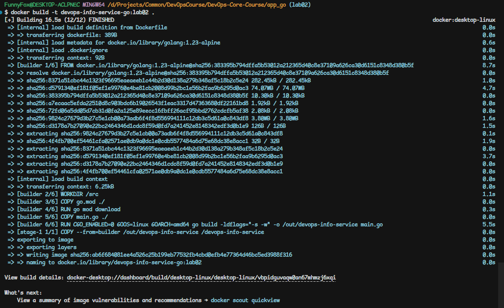
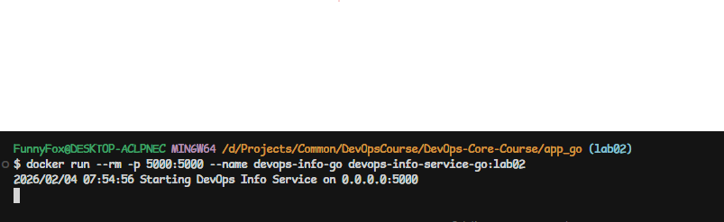
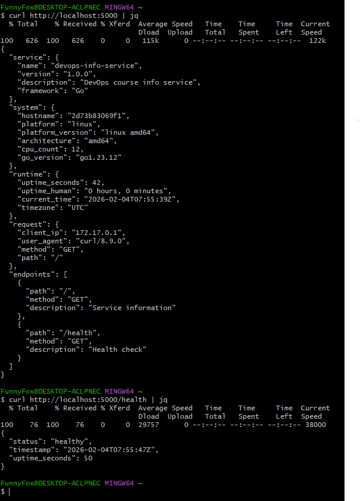

# Lab 2 Bonus — Multi-Stage Build (Go)

## Multi-Stage Build Strategy

### Overview

For the Go version of the DevOps Info Service, I implemented a **two-stage Docker build**:

1. **Builder stage** — uses the full Go toolchain image to compile the binary.
2. **Runtime stage** — uses a minimal `scratch` image and only contains the compiled binary.

This separates **build-time dependencies** (compiler, Go modules) from the **runtime environment**, which keeps the final image very small and reduces the attack surface.

### Dockerfile Summary

- **Builder stage** (`golang:1.23-alpine`):
  - Uses a lightweight Go image with Alpine Linux.
  - Downloads Go modules via `go.mod`.
  - Builds a **static binary** with `CGO_ENABLED=0` and `-ldflags="-s -w"`.
- **Runtime stage** (`scratch`):
  - Copies only the compiled binary from the builder.
  - Exposes port `5000`.
  - Starts the service using `ENTRYPOINT ["/devops-info-service"]`.

**Key properties:**
- No Go compiler or build tools in the final image.
- Only a single executable file is present at runtime.


## Image Size Comparison (Builder vs Final)

### Final Runtime Image

After building the image, the size is:

```bash
$ docker image ls | grep -E "devops-info-service-go|golang"
devops-info-service-go          lab02     ab6f684081ee   2 minutes ago    5.26MB
```

This shows that the **final runtime image** (`devops-info-service-go:lab02`) is only **5.26 MB**.

### Layer Breakdown (Runtime Image)

```bash
$ docker history devops-info-service-go:lab02
IMAGE          CREATED         CREATED BY                                      SIZE      COMMENT
ab6f684081ee   2 minutes ago   ENTRYPOINT ["/devops-info-service"]             0B        buildkit.dockerfile.v0
<missing>      2 minutes ago   EXPOSE map[5000/tcp:{}]                         0B        buildkit.dockerfile.v0
<missing>      2 minutes ago   COPY /out/devops-info-service /devops-info-s…   5.26MB    buildkit.dockerfile.v0
```

Even though the intermediate builder image is not shown here, we know that:
- The builder image (`golang:1.23-alpine` plus compiled artifacts) is **much larger** because it includes the entire Go compiler and Alpine userland.
- The final image only contains a single binary (~5 MB) and nothing else.

### Why It Matters

- **Storage & network**: Smaller images are faster to push/pull and consume less disk space.
- **Security**: Fewer packages and tools present in the runtime image mean a smaller attack surface.
- **Deployment speed**: 5MB images deploy faster in CI/CD and to Kubernetes nodes.

## Build & Run Process

### Build (Multi-Stage)

**Command:**
```bash
docker build -t devops-info-service-go:lab02 .
```

**Build output:**


### Run Container

**Command:**
```bash
docker run --rm -p 5000:5000 --name devops-info-go devops-info-service-go:lab02
```

**Runtime output:**


### Test Endpoints

**Commands:**
```bash
curl http://localhost:5000/
curl http://localhost:5000/health
```

**curl output:**


## Technical Explanation of Each Stage

### Builder Stage (`golang:1.23-alpine AS builder`)

- **Base image**: `golang:1.23-alpine`
  - Contains Go 1.23 toolchain and minimal Alpine-based userspace.
- **Working directory**: `WORKDIR /src`
  - All build commands run from a dedicated directory.
- **Module download**:
  - `COPY go.mod ./`
  - `RUN go mod download`
  - This caches module dependencies so they are not re-downloaded on every code change.
- **Build command**:
  - `COPY main.go ./`
  - `RUN CGO_ENABLED=0 GOOS=linux GOARCH=amd64 go build -ldflags="-s -w" -o /out/devops-info-service main.go`
  - `CGO_ENABLED=0` → produce a **pure static** binary, so no shared libs are required in runtime image.
  - `GOOS=linux GOARCH=amd64` → ensures the binary targets Linux/amd64 (the same OS/arch as the container runtime).
  - `-ldflags="-s -w"` → strip debug info and symbol tables, reducing binary size.

### Runtime Stage (`FROM scratch`)

- **Base image**: `scratch`
  - An empty base image, literally nothing inside by default.
- **Binary copy**:
  - `COPY --from=builder /out/devops-info-service /devops-info-service`
  - Brings only the compiled binary into the runtime image.
- **Port & entrypoint**:
  - `EXPOSE 5000` — documents that the service listens on port 5000.
  - `ENTRYPOINT ["/devops-info-service"]` — starts the Go service immediately when the container runs.

Because the binary is static and self-contained, the runtime stage does not need libc, shell, or any additional packages.

## Why Multi-Stage Builds Matter for Compiled Languages

1. **Separation of concerns**  
   - Build stage handles compilation, tests, and tooling.  
   - Runtime stage runs only the final artifact.

2. **Smaller images**  
   - Compilers and dev tools are large but not needed at runtime.
   - Removing them dramatically reduces size (e.g., from hundreds of MB to ~5 MB).

3. **Better security**  
   - Fewer binaries and libraries → fewer potential vulnerabilities.
   - No compilers or shells in production containers.

4. **Faster deployment and scaling**  
   - Less data to transfer across network and nodes.
   - Faster spin-up in orchestrators like Kubernetes.

## Summary of Results

- Implemented a **two-stage** Docker build for the Go DevOps Info Service.
- Achieved a final runtime image size of **~5.26 MB** on top of `scratch`.
- The final image:
  - Contains only a single statically linked Go binary.
  - Runs the same HTTP API (`/` and `/health`) as the Python version.
  - Demonstrates the benefits of multi-stage builds for compiled languages.

