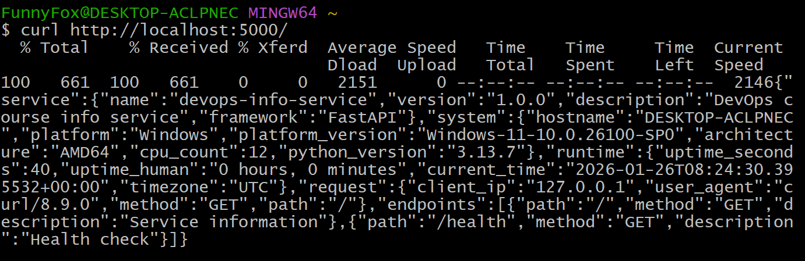
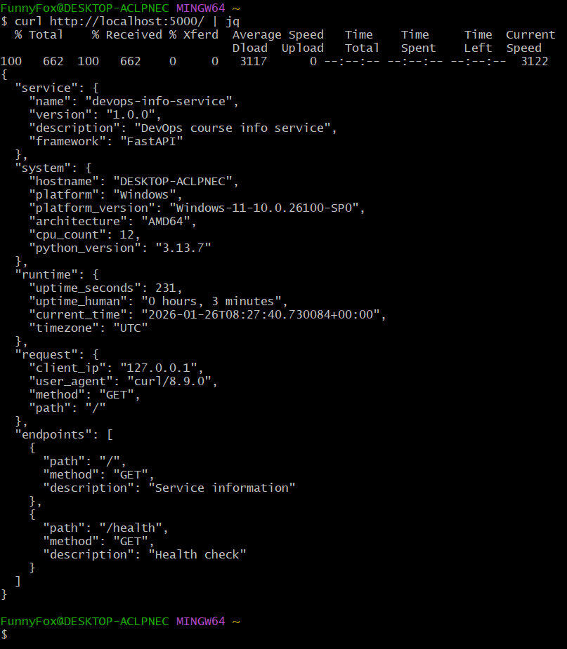
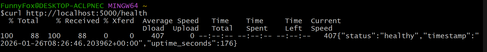

# DevOps Info Service

[](https://github.com/FunnyFoXD/DevOps-Core-Course/actions/workflows/python-ci.yml)
[](https://codecov.io/gh/FunnyFoXD/DevOps-Core-Course)

A web service that provides information about itself and its runtime environment. Built with FastAPI for the DevOps course.

## Overview

The DevOps Info Service is a RESTful API that reports:
- Service metadata (name, version, framework)
- System information (hostname, platform, architecture, CPU count, Python version)
- Runtime information (uptime, current time, timezone)
- Request details (client IP, user agent, method, path)
- Available API endpoints

This service will be used for future DevOps labs

## Prerequisites

- **Python**: 3.11 or higher (for running python app)
- **pip**: Python package manager (for downloading python packages)
- **Git**: Version control (for cloning repo)

## Installation

1) **Clone the repo**:
```bash
git clone https://github.com/FunnyFoXD/DevOps-Core-Course.git # HTTPS
# or
git clone git@github.com:FunnyFoXD/DevOps-Core-Course.git # SSH

# Go in the directory
cd app_python
```

2) **Create a virtual environment**
```bash
python -m venv venv
# or
python3 -m venv venv
```

3) **Activate virtual environment**

**Windows**
```bash
venv/Scripts/activate
```

**Linux/MacOS**
```bash
source venv/bin/activate
```

4) **Install dependencies**
```bash
pip install -r requirements.txt
```

## Running the Application

### Default Configuration

Run the service with default settings (host: `0.0.0.0`, port: `5000`):
```bash
python app.py
#or
python3 app.py
```
The service will be available at `http://localhost:5000`

### Custom Configurations

#### Custom port
```bash
PORT=8080 python app.py
# or
PORT=8080 python3 app.py
```

#### Custom host and port
```bash
HOST=127.0.0.1 PORT=3000 python app.py
# or
HOST=127.0.0.1 PORT=3000 python3 app.py
```

#### Enable debug mode
```bash
DEBUG=true python app.py
```

## Docker

### Build image (local)

**Command:**
```bash
docker build -t <name>:<tag> .
```

**Example:**
```bash
docker build -t devops-info-service:lab02 .
```

### Run container

**Command:**
```bash
docker run --rm -p <host_port>:<container_port> --name <container_name> <name>:<tag>
```

**Example (default app port 5000):**
```bash
docker run --rm -p 5000:5000 --name devops-info devops-info-service:lab02
```

### Pull from Docker Hub and run

**Command:**
```bash
docker pull <dockerhub_username>/<repo>:<tag>
docker run --rm -p 5000:5000 <dockerhub_username>/<repo>:<tag>
```

**Example:**
```bash
docker pull funnyfoxd/devops-info-service:lab02
docker run --rm -p 5000:5000 funnyfoxd/devops-info-service:lab02
```

## API Endpoints
### `GET /`

Returns service and system information

**Response Example:**
```json
{
  "service": {
    "name": "devops-info-service",
    "version": "1.0.0",
    "description": "DevOps course info service",
    "framework": "FastAPI"
  },
  "system": {
    "hostname": "DESKTOP-ACLPNEC",
    "platform": "Windows",
    "platform_version": "Windows-11-10.0.26100-SP0",
    "architecture": "AMD64",
    "cpu_count": 12,
    "python_version": "3.13.7"
  },
  "runtime": {
    "uptime_seconds": 3600,
    "uptime_human": "1 hour, 0 minutes",
    "current_time": "2026-01-25T18:00:00.000000+00:00",
    "timezone": "UTC"
  },
  "request": {
    "client_ip": "127.0.0.1",
    "user_agent": "curl/8.9.0",
    "method": "GET",
    "path": "/"
  },
  "endpoints": [
    {"path": "/", "method": "GET", "description": "Service information"},
    {"path": "/health", "method": "GET", "description": "Health check"}
  ]
}
```

**Testing:**
``` bash
curl http://localhost:5000/
# Or with JSON formatting
curl http://localhost:5000/ | jq
```

**Screenshots:**



### `GET /health`

Health check endpoint for monitoring and Kubernetes probes

**Response Example:**
```json
{
  "status": "healthy",
  "timestamp": "2026-01-25T18:00:00.000000+00:00",
  "uptime_seconds": 3600
}
```

**Testing:**
```bash
curl http://localhost:5000/health
# or with JSON formatting
curl http://localhost:5000/health | jq
# HTTP Status Codes:
# - 200 OK - Service is healthy
# - 503 Service Unavailable - Service is not healthy
```

**Screenshot:**


## Configuration

The application can be configured using environment variables:

| Variable | Default | Description |
|----------|---------|-------------|
| `HOST` | `0.0.0.0` | Host address to bind the server |
| `PORT` | `5000` | Port number to listen on |
| `DEBUG` | `False` | Enable debug mode |

## Testing

### Running Tests Locally

Install test dependencies
```bash
pip install -r requirements.txt
```

Run tests
```bash
pytest
```

Run with verbose output
```bash
pytest -v
```

Run with coverage (if pytest-cov is installed)
```bash
pytest --cov=app --cov-report=term
```

### Test Structure

Tests are located in `tests/` directory:
- `test_app.py` - Unit tests for API endpoints
  - Tests for `GET /` endpoint (JSON structure, fields, types)
  - Tests for `GET /health` endpoint (status, fields, values)
  - Error handling tests (404, wrong methods)