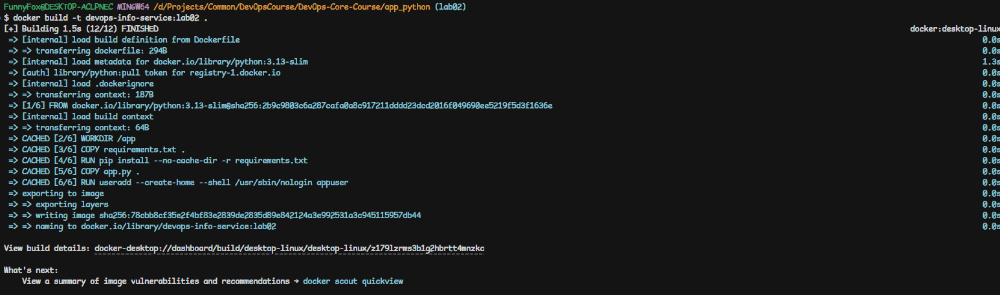
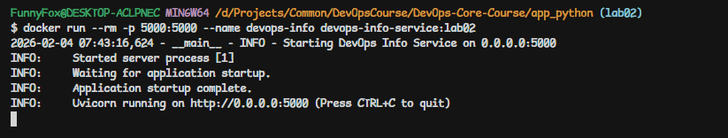
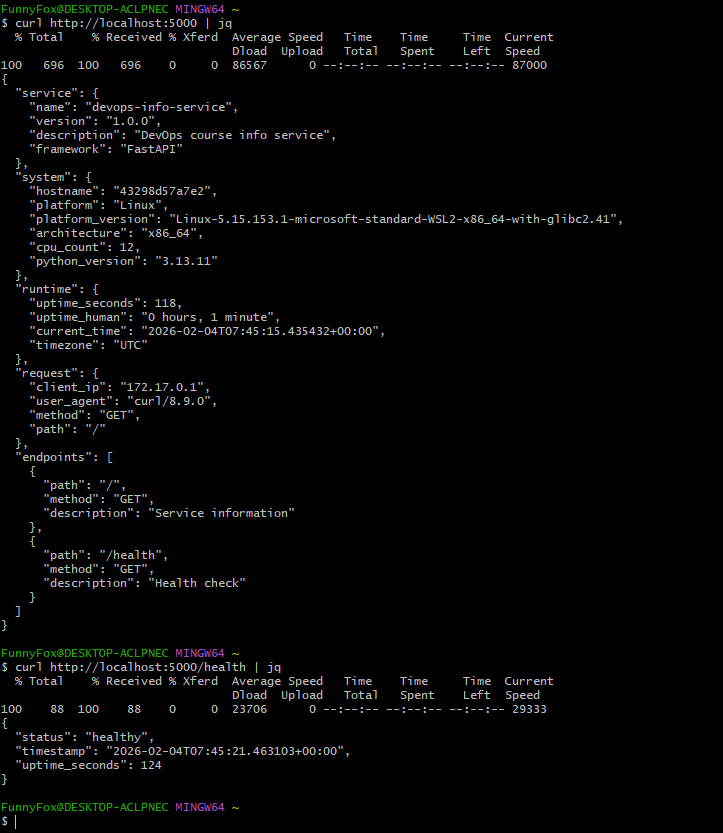

# Lab 2 Submission — Docker Containerization (Python)

## Docker Best Practices Applied

### 1. Pinned base image version

**Implementation:**
- Base image: `python:3.13-slim`

**Why it matters:**
- Using a specific version makes builds more reproducible and reduces surprises from upstream changes.
- The `slim` variant reduces image size compared to the full image, which usually means fewer packages and smaller attack surface.

### 2. Non-root user

**Implementation:**
- A dedicated user is created inside the image and the container runs as that user:
  - `RUN useradd --create-home --shell /usr/sbin/nologin appuser`
  - `USER appuser`

**My terminal output:**
```bash
$ docker exec -it devops-info id
uid=1000(appuser) gid=1000(appuser) groups=1000(appuser)
```

**Why it matters:**
- Running as root in containers increases the impact of vulnerabilities and misconfigurations.
- A non-root user reduces privileges and is a baseline security best practice.

### 3. Layer caching via proper COPY order

**Implementation:**
- Dependencies are installed using `requirements.txt` before copying application code:
  - `COPY requirements.txt .`
  - `RUN pip install --no-cache-dir -r requirements.txt`
  - `COPY app.py .`

**Why it matters:**
- Docker caches layers. If only `app.py` changes, dependency installation can stay cached, speeding up rebuilds significantly.

### 4. Copy only necessary runtime files

**Implementation:**
- The image only copies:
  - `requirements.txt`
  - `app.py`

**Why it matters:**
- Avoids shipping development artifacts into production images.
- Smaller image and smaller build context → faster build and fewer accidental leaks.

### 5. `.dockerignore` to reduce build context

**Implementation:**
The `.dockerignore` excludes:
- Python caches (`__pycache__/`, `*.pyc`, etc.)
- Virtual environments (`venv/`, `.venv/`, `env/`)
- VCS/IDE directories (`.git/`, `.vscode/`, `.idea/`)
- Logs and test artifacts (`*.log`, `.coverage`, `htmlcov/`, etc.)
- Non-runtime content (`docs/`, `tests/`)

**Why it matters:**
- Smaller build context makes `docker build` faster.
- Prevents accidentally copying irrelevant or sensitive files.
- Keeps the final image cleaner.

---

## Image Information & Decisions

### Base image choice

- **Chosen**: `python:3.13-slim`
- **Rationale**:
  - Matches the app's Python runtime needs.
  - `slim` reduces size vs full Debian-based images.
  - Pinning version improves reproducibility.

### Final image size

**Terminal output:**
```bash
$ docker image ls
REPOSITORY                      TAG       IMAGE ID       CREATED          SIZE
funnyfoxd/devops-info-service   lab02     78cbb8cf35e2   10 minutes ago   141MB
```

**Assessment:**
- 141MB is acceptable for a beginner-friendly FastAPI image on `slim`.
- Further reductions are possible (e.g., using `--no-cache-dir` already helps; additional trimming could include using `python -m pip install --upgrade pip` only when needed, removing build deps, or using a more minimal runtime strategy), but the current image meets lab requirements and remains clear/readable.

### Layer structure (high level)

1. Base `python:3.13-slim`
2. `WORKDIR /app`
3. Copy `requirements.txt`
4. Install dependencies
5. Copy `app.py`
6. Create `appuser` and switch to non-root
7. Expose port 5000 and run `python app.py`

---

## Build & Run Process

### Build

**Command (example):**
```bash
docker build -t devops-info-service:lab02 .
```

**Terminal output:**


### Run (local image)

**Command (example):**
```bash
docker run --rm -p 5000:5000 --name devops-info devops-info-service:lab02
```

**Terminal output:**


### Test endpoints

**Commands:**
```bash
curl http://localhost:5000/
curl http://localhost:5000/health
```

**Terminal output:**


### Docker Hub

**Repository URL:**
- `https://hub.docker.com/r/funnyfoxd/devops-info-service`

**Tagging strategy:**
- `lab02`: a lab-specific tag to clearly identify the image version used for Lab 02 submission and grading.

**Terminal output — image list:**
```bash
$ docker images | grep devops-info-service
funnyfoxd/devops-info-service   lab02     78cbb8cf35e2   6 minutes ago   141MB
devops-info-service             lab02     78cbb8cf35e2   6 minutes ago   141MB
```

**Terminal output — push:**
```bash
$ docker push funnyfoxd/devops-info-service:lab02
The push refers to repository [docker.io/funnyfoxd/devops-info-service]
2493b57876c8: Pushed
bc8ebad9c4b4: Pushed
082546257854: Pushed
09cf3126b796: Pushed
1d8c3886cb1d: Pushed
6f3d061c2e62: Mounted from library/python
1a619cfa942c: Mounted from library/python
c07c86e6f1e8: Mounted from library/python
a8ff6f8cbdfd: Mounted from library/python
lab02: digest: sha256:3c555194175b6981dd90a353e89cff96755e5f9dbc20406ceecf07cc9950badc size: 2199
```

**Terminal output — pull:**
```bash
$ docker pull funnyfoxd/devops-info-service:lab02
lab02: Pulling from funnyfoxd/devops-info-service
Digest: sha256:3c555194175b6981dd90a353e89cff96755e5f9dbc20406ceecf07cc9950badc
Status: Image is up to date for funnyfoxd/devops-info-service:lab02
docker.io/funnyfoxd/devops-info-service:lab02
```

---

## Technical Analysis

### Why this Dockerfile works

- The app uses `HOST=0.0.0.0` and `PORT=5000` by default, so it binds to all interfaces inside the container and can be accessed via port mapping.
- Dependencies are installed from `requirements.txt`.
- The container starts the app via `python app.py`, which runs Uvicorn with the configured host/port.

### What happens if you change layer order?

If `COPY app.py .` is placed before dependency installation, then any change to the application code will invalidate Docker's cache for the later layers, and dependencies will be reinstalled on every rebuild, making development and CI builds much slower.

### Security considerations implemented

- **Non-root user**: reduces privilege inside container.
- **Slim base image**: fewer packages installed by default → smaller attack surface.
- **`.dockerignore`**: avoids including unnecessary files in build context and image.

### How `.dockerignore` improves the build

- **Speed**: less data sent to the Docker daemon during build.
- **Reproducibility**: reduces accidental inclusion of local artifacts (venv, caches).
- **Security**: avoids shipping editor configs, logs, and other irrelevant files.

---

## Challenges & Solutions

### Challenge 1: Verifying non-root execution

**Problem:**
- Needed to prove the container does not run as root.

**Solution:**
- Used `docker exec -it devops-info id` and confirmed `uid=1000(appuser)`.