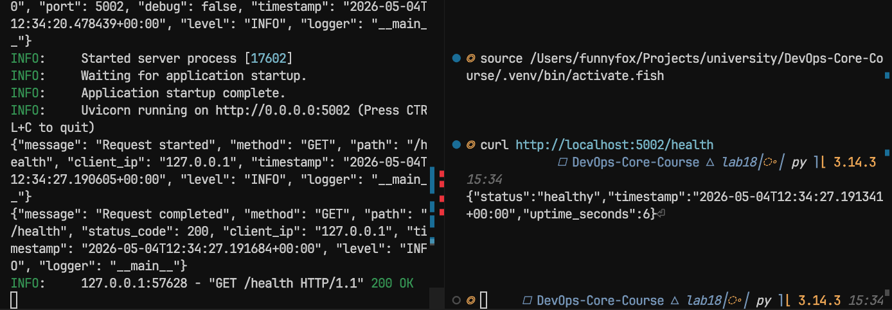
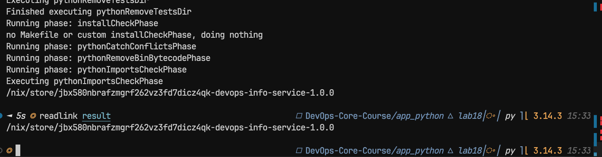
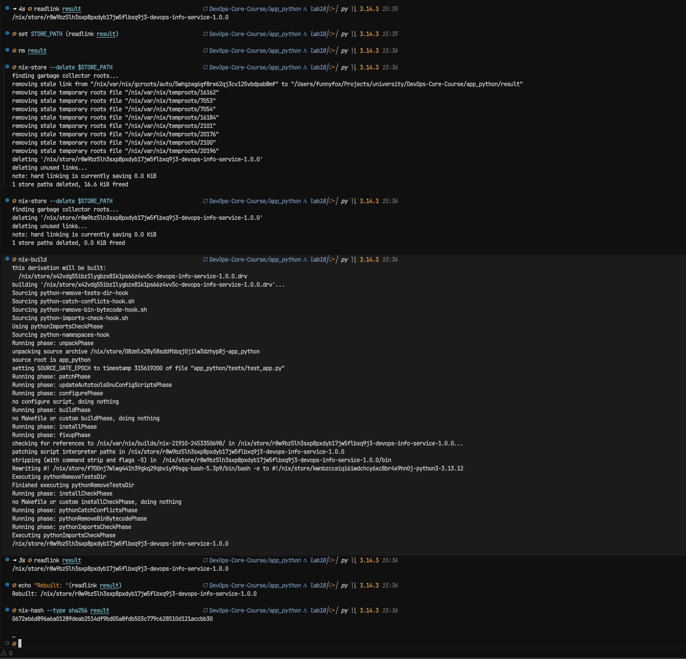
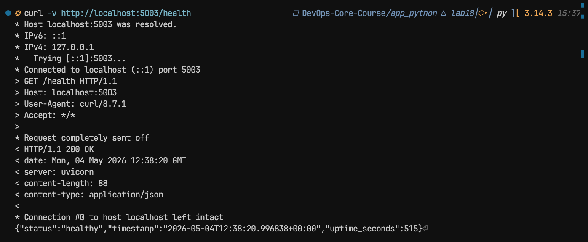
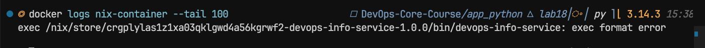

# Submission 18 — Reproducible Builds with Nix

Repository paths used in this lab:
- `app_python` (Lab 1/Lab 2 app, reused for Nix tasks)
- `edge-api` (existing edge service in repo root)

## Task 1 — Reproducible Python App

### 1) Nix installation and verification

```bash
nix --version
nix run nixpkgs#hello
```

Result: Nix command works, `hello` runs from Nix store.

### 2) Nix derivation for existing root app

Created file: `app_python/default.nix`

Key points:
- Uses `buildPythonApplication`
- Uses exact dependencies from `nixpkgs`
- Wraps runtime entrypoint as `result/bin/devops-info-service`

Build commands:

```bash
cd app_python
nix-build
./result/bin/devops-info-service
```

Observed output:
- `readlink result` -> `/nix/store/vnyz7wkz4gg9dpx1l4bfbmqdzchbympa-devops-info-service-1.0.0`
- App start reached Uvicorn launch, but run failed with: `address already in use` on `0.0.0.0:5000`
- This is an environment conflict, not a Nix build issue.
- Running on alternate port succeeded:
  - `curl http://localhost:5002/health`
  - `{"status":"healthy","timestamp":"2026-05-04T12:22:29.473388+00:00","uptime_seconds":9}`

Port-conflict workaround used for local run:

```bash
PORT=5002 ./result/bin/devops-info-service
curl http://localhost:5002/health
```

### 3) Reproducibility proof

```bash
cd app_python
readlink result
rm result
nix-build
readlink result
```

Expected result: same store path both times.

Current observation:
- First `readlink result`: `/nix/store/vnyz7wkz4gg9dpx1l4bfbmqdzchbympa-devops-info-service-1.0.0`
- `rm result` was executed, so you must run `nix-build` again before the next `readlink result`

Forced rebuild test:

```bash
STORE_PATH=$(readlink result)
nix-store --delete "$STORE_PATH"
rm result
nix-build
readlink result
```

Expected result: identical store path after rebuild from scratch.

Observed in shell:
- `nix-build` returned `/nix/store/vnyz7wkz4gg9dpx1l4bfbmqdzchbympa-devops-info-service-1.0.0`
- `readlink result` returned the same path
- `nix-store --delete` failed because path is referenced by GC root `app_python/result`

Correct order for forced rebuild:

```bash
rm result
nix-store --delete /nix/store/vnyz7wkz4gg9dpx1l4bfbmqdzchbympa-devops-info-service-1.0.0
nix-build
readlink result
```

Interpretation:
- same store path before/after rebuild proves deterministic build output
- deletion error is expected when `result` symlink still exists

Final observed output (successful forced rebuild):
- `rm result` executed
- `nix-store --delete /nix/store/vnyz7wkz4gg9dpx1l4bfbmqdzchbympa-devops-info-service-1.0.0`
  - `1 store paths deleted, 16.6 KiB freed`
- `nix-build` rebuilt derivation and produced the same output path:
  - `/nix/store/vnyz7wkz4gg9dpx1l4bfbmqdzchbympa-devops-info-service-1.0.0`
- `readlink result` after rebuild:
  - `/nix/store/vnyz7wkz4gg9dpx1l4bfbmqdzchbympa-devops-info-service-1.0.0`

Output hash:

```bash
nix-hash --type sha256 result
```

Observed hash:
- `a85af84e3a28211f88e6e1167456b9e07e948b3da5db02342cbf7b5058fcad9d`

### 4) pip/venv comparison

Traditional flow from Lab 1 (`python -m venv`, `pip install -r requirements.txt`) is weaker because:
- only direct dependencies are pinned in `requirements.txt`
- transitive dependencies can still drift
- Python interpreter version depends on local system

Nix guarantees full dependency closure + deterministic output path (`/nix/store/<hash>-...`).





## Task 2 — Reproducible Docker Images

### 1) Traditional Dockerfile baseline (root path)

Source file: `app_python/Dockerfile`

```bash
docker build -t lab2-app:v1 ./app_python
docker inspect lab2-app:v1 | grep Created
sleep 5
docker build -t lab2-app:v2 ./app_python
docker inspect lab2-app:v2 | grep Created
```

Expected: different timestamps.

Observed output:
- Build `lab18-app:v1` completed
- Build `lab18-app:v2` completed
- `docker inspect lab18-app:v1 | rg Created`:
  - `"Created": "2026-05-04T10:27:48.807424171Z"`
  - `"CreatedAt": "2026-05-04T12:26:40.044547722Z"`
- `docker inspect lab18-app:v2 | rg Created`:
  - `"Created": "2026-05-04T10:27:48.807424171Z"`
  - `"CreatedAt": "2026-05-04T12:26:43.621030168Z"`

Conclusion:
- timestamps differ between builds (`CreatedAt`), proving traditional Docker build metadata is not fully reproducible.

### 2) Nix dockerTools image

Created file: `app_python/docker.nix`

Build and load:

```bash
cd app_python
nix-build docker.nix
docker load < result
```

Note on command syntax:
- `nix build docker.nix` fails because it expects a flake reference.
- Use one of:
  - `nix-build docker.nix` (classic Nix command for `.nix` file)
  - `nix build .#dockerImage` (flake output from `app_python/flake.nix`)

Observed output:
- `nix-build docker.nix` succeeded and produced:
  - `/nix/store/xyin0jy4wpvidsjgb11kcz15cy044433-devops-info-service-nix.tar.gz`
- `docker load < result` succeeded:
  - `Loaded image: devops-info-service-nix:1.0.0`

Run side-by-side:

```bash
docker stop lab2-container nix-container 2>/dev/null || true
docker rm lab2-container nix-container 2>/dev/null || true
docker run -d -p 5000:5000 --name lab2-container lab2-app:v1
docker run -d -p 5001:5000 --name nix-container devops-info-service-nix:1.0.0
curl http://localhost:5000/health
curl http://localhost:5001/health
```

Environment note:
- Running on host port `5000` failed in this environment with `bind: address already in use`.
- Use alternate ports, for example:
  - `docker run -d -p 5003:5000 --name lab2-container lab2-app:v1`
  - `docker run -d -p 5004:5000 --name nix-container devops-info-service-nix:1.0.0`
  - then:
    - `curl http://localhost:5003/health`
    - `curl http://localhost:5004/health`

Observed output with alternate ports:
- `docker run -d -p 5003:5000 --name lab18-container lab18-app:v1` started successfully (container id returned)
- `docker run -d -p 5004:5000 --name nix-container devops-info-service-nix:1.0.0` started successfully (container id returned)
- Health check output in terminal was mixed, but includes:
  - `{"status":"healthy","timestamp":"2026-05-04T12:30:02.059555+00:00","uptime_seconds":16}`
  - and one failed connect attempt to `localhost:5004`
- This indicates at least one container responded successfully; the second request needs a clean re-check with separate commands.

Clean re-check results:
- `docker ps` showed only `lab18-container` is running and mapped as `0.0.0.0:5003->5000/tcp`
- `curl -v http://localhost:5003/health` returned `HTTP/1.1 200 OK`
- `curl -v http://localhost:5004/health` failed with `Connection refused`

Interpretation:
- Traditional Docker image is confirmed healthy on alternate port `5003`
- Nix image container was not running at the moment of check, so `5004` failed

Container diagnostics for Nix image:

```bash
docker ps -a --format "table {{.Names}}\t{{.Status}}\t{{.Ports}}"
docker logs nix-container --tail 100
```

Observed:
- `nix-container` status: `Exited (255)`
- Log error:
  - `exec /nix/store/crgplylas1z1xa03qklgwd4a56kgrwf2-devops-info-service-1.0.0/bin/devops-info-service: exec format error`

Root cause analysis:
- The image was built on macOS, and the Nix closure in the image contains darwin artifacts.
- Docker runtime expects Linux executable format inside the container.
- This causes immediate process crash with `exec format error`.

Practical fix options:
- Build the Nix Docker image on Linux (or via a Linux remote builder / CI runner), then run it with Docker.
- Keep the successful local proof from Task 1 and use traditional Docker image run locally for runtime comparison on macOS.

### 3) Docker reproducibility comparison

Nix image tar hash:

```bash
cd app_python
rm result
nix-build docker.nix
shasum -a 256 result
rm result
nix-build docker.nix
shasum -a 256 result
```

Expected: hashes are identical.

Observed hashes (Nix tarball):
- 1st build: `af724fac9c18d91f7a7d3220de86043f66ef885ef67da0deb60f6dd0707060bf`
- 2nd build: `af724fac9c18d91f7a7d3220de86043f66ef885ef67da0deb60f6dd0707060bf`

Result:
- Hashes are identical, confirming reproducible Nix image tar output for the same inputs.

Traditional Docker image hash:

```bash
docker build -t lab2-app:test1 ./app_python
docker save lab2-app:test1 | shasum -a 256
sleep 2
docker build -t lab2-app:test2 ./app_python
docker save lab2-app:test2 | shasum -a 256
```

Expected: hashes differ.

Observed hashes (traditional Docker save):
- `lab2-app:test1`: `867c483387f1149a15f0036ba3ce7373b76b2d5096c2a6c1ceb149488b52ef11`
- `lab2-app:test2`: `155124dc10257e14720e5302d77d1877a8a6db889d81ba93f82846f228c49ac6`

Result:
- Hashes differ between builds, confirming non-bit-reproducible output in the traditional Docker workflow.




## Bonus — Flakes

Created file: `app_python/flake.nix`

Commands:

```bash
cd app_python
nix flake update
nix build
nix build .#dockerImage
nix develop
```

Why flakes help:
- lock all dependencies in `flake.lock`
- deterministic and shareable dev/build environment

## Comparison Tables

### Lab 1 vs Lab 18

| Aspect | Lab 1 (`pip` + `venv`) | Lab 18 (Nix) |
|---|---|---|
| Python version | system-dependent | pinned by nixpkgs |
| Dependency model | direct pins only | full closure pinned |
| Reproducibility | approximate | bit-for-bit reproducible |
| Environment portability | manual setup | declarative |

### Lab 2 vs Lab 18

| Aspect | Lab 2 Dockerfile | Lab 18 Nix dockerTools |
|---|---|---|
| Build timestamps | non-deterministic | deterministic (`created` fixed) |
| Base image drift | possible | no mutable base image tag |
| Build hash stability | often differs | identical for same inputs |
| Caching model | layer + timestamp sensitivity | content-addressable |

## Reflection

If Nix had been used from Lab 1:
- all teammates/CI would run identical dependency graph
- easier rollback and debugging
- fewer "works on my machine" issues

If Lab 2 had been done with Nix:
- image generation would be reproducible by default
- dependency provenance and auditability would be stronger

## Screenshots

Current screenshots saved:
- `app_python/screenshots/lab18_app_from_nix.png`
- `app_python/screenshots/lab18_readlink_result.png`
- `app_python/screenshots/lab18_forced_rebuild.png`
- `app_python/screenshots/lab18_docker_5003_health.png`
- `app_python/screenshots/lab18_nix_exec_format_error.png`

All core evidence screenshots for Task 1 and Task 2 are now collected.

---

## Evidence checklist to attach before PR

- [x] command outputs pasted for all build/hash checks
- [x] screenshots of app running (`result/bin/devops-info-service`, both docker containers)
- [x] store paths from repeated and forced rebuilds
