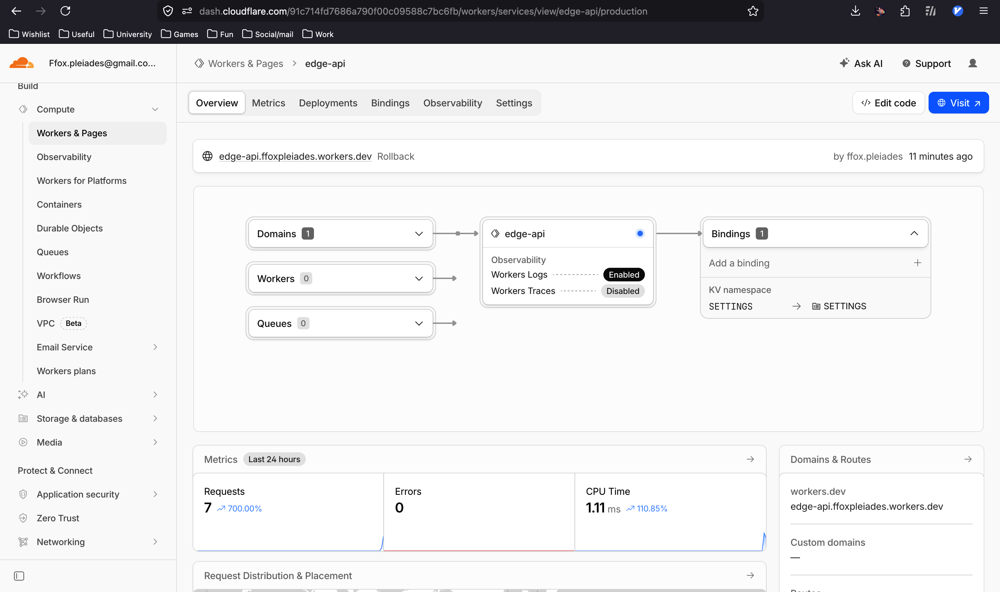
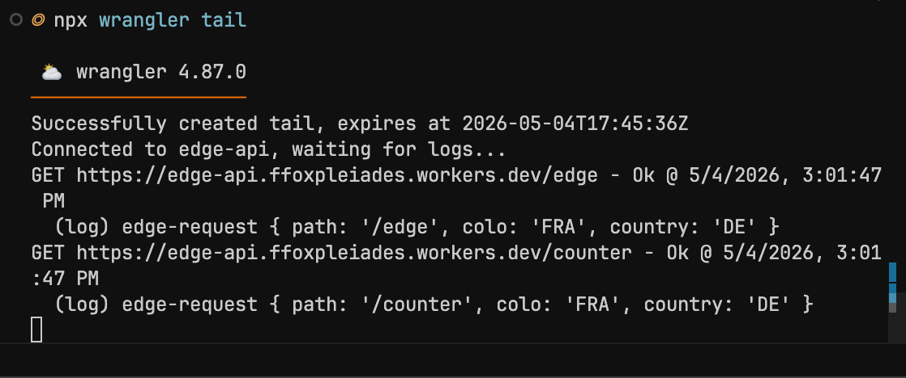
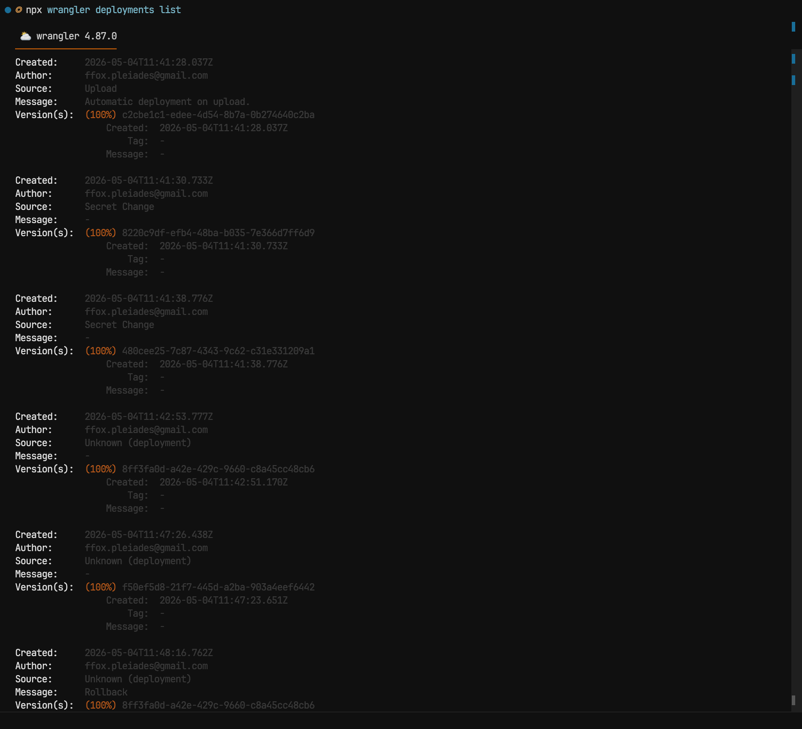

# Lab 17 — Cloudflare Workers (documentation)

This file satisfies Task 6 of the lab. URLs and evidence are recorded below.

## 1. Deployment summary

| Item | Value |
|------|------------|
| **Worker URL** | `https://edge-api.ffoxpleiades.workers.dev` |
| **Main routes** | `GET /`, `GET /health`, `GET /deployment`, `GET /edge`, `GET /counter`, `GET /config` |
| **Plaintext vars** | `APP_NAME`, `COURSE_NAME`, `WORKER_VERSION` in `wrangler.jsonc` |
| **Secrets** | `API_TOKEN`, `ADMIN_EMAIL` via `wrangler secret put` (not in git) |
| **Persistence** | Workers KV binding `SETTINGS`; counter key `visits` |

## 2. Evidence

Screenshots are stored in the **`screenshots/`** directory next to this file.

1. **Cloudflare dashboard** — Worker `edge-api` overview:
   

2. **Example `/edge` JSON** — Response from public URL:

   ```bash
   curl -sS "https://edge-api.ffoxpleiades.workers.dev/edge"
   ```

   ```json
   {
     "colo": "FRA",
     "country": "DE",
     "city": "Frankfurt am Main",
     "asn": 50053,
     "httpProtocol": "HTTP/2",
     "tlsVersion": "TLSv1.3"
   }
   ```

3. **Config/secrets verification (`/config`)** — production check result:

   ```json
   {
     "secretsConfigured": {
       "API_TOKEN": true,
       "ADMIN_EMAIL": true
     },
     "plaintextVars": {
       "APP_NAME": "edge-api",
       "COURSE_NAME": "devops-core",
       "WORKER_VERSION": "1.0.0"
     }
   }
   ```

4. **Logs or metrics** — `npx wrangler tail` connected successfully and captured request logs:

   ```text
   Successfully created tail, expires at 2026-05-04T17:45:36Z
   Connected to edge-api, waiting for logs...
   GET https://edge-api.ffoxpleiades.workers.dev/edge - Ok @ 5/4/2026, 2:46:10 PM
     (log) edge-request { path: '/edge', colo: 'FRA', country: 'DE' }
   GET https://edge-api.ffoxpleiades.workers.dev/counter - Ok @ 5/4/2026, 2:46:11 PM
     (log) edge-request { path: '/counter', colo: 'FRA', country: 'DE' }
   ```

   Terminal screenshots for `wrangler tail` and requests:
   - `lab17_wrangler_tail.png`:
     
   - `lab17_wrangler_tail_list.png` (extended tail output or related log output):
     

5. **Deployment history (from `npx wrangler deployments list`)** — entries include:
   - automatic upload deployment (`c2cbe1c1-edee-4d54-8b7a-0b274640c2ba`)
   - secret-change deployment (`8220c9df-efb4-48ba-b035-7e366d7ff6d9`)
   - secret-change deployment (`480cee25-7c87-4343-9c62-c31e331209a1`)
   - initial public deployment (`8ff3fa0d-a42e-429c-9660-c8a45cc48cb6`)
   - second version deployment after `WORKER_VERSION=1.0.1` (`f50ef5d8-21f7-445d-a2ba-903a4eef6442`)
   - rollback deployment with message `Rollback` back to (`8ff3fa0d-a42e-429c-9660-c8a45cc48cb6`)

6. **Deploy/Rollback operations summary**
   - Second deploy succeeded with vars showing `WORKER_VERSION = "1.0.1"`.
   - Rollback command executed successfully and restored version `8ff3fa0d-a42e-429c-9660-c8a45cc48cb6` to 100% of traffic.
   - This demonstrates deployment history inspection and operational rollback handling.

## 3. Global edge behavior (Tasks 3–4 notes)

### How Workers runs “globally”

Cloudflare runs your script on a lightweight isolate at **edge PoPs** close to the client. The platform picks a location per request; you do not choose “regions” like `eu-west-1` / `us-east-1`. That is why there is **no “deploy to three regions”** step: distribution is built into the product.

### `workers.dev` vs Routes vs Custom Domains

| Mechanism | What it does |
|-----------|----------------|
| **`workers.dev`** | Quick public URL on `https://<worker-name>.<account-subdomain>.workers.dev` with no DNS zone setup. |
| **Routes** | Attach the Worker to traffic for a hostname already on Cloudflare (path patterns, zones). |
| **Custom Domains** | Make your Worker the origin for a specific host/subdomain with managed TLS and routing. |

This lab uses **`workers.dev`** for the required deployment; custom domains are optional.

### Plaintext vars vs secrets

Plaintext `vars` in `wrangler.jsonc` are **not** suitable for secrets: they live in version control (if committed), appear in the dashboard, and anyone with project access can read them. Sensitive values belong in **secrets** (`wrangler secret put`) or external vaults, and optionally in **`.dev.vars`** locally (gitignored).

### KV persistence check

1. Call `GET /counter` and note `visits`.
2. Run `npx wrangler deploy` again.
3. Call `GET /counter` again — the count should **continue from the stored value** (same KV namespace id).

Document what you stored: **key** `visits` in namespace bound as `SETTINGS`.

## 4. Observability & operations (Task 5)

- **Logs:** `src/index.ts` uses `console.log("edge-request", …)`. View with `npx wrangler tail` or Workers Logs in the dashboard.
- **Metrics:** In the dashboard, review request volume, errors, or CPU time for the Worker.
- **Deployments:** Deploy at least two versions (e.g. bump `WORKER_VERSION` in `wrangler.jsonc` and redeploy). Use `npx wrangler deployments list` and `npx wrangler rollback` (or the dashboard) to view history and roll back.

## 5. Kubernetes vs Cloudflare Workers

| Aspect | Kubernetes | Cloudflare Workers |
|--------|------------|---------------------|
| **Setup complexity** | Higher: cluster, networking, manifests/Helm, often CI and registry. | Lower: account + Wrangler + small script; no cluster to operate. |
| **Deployment speed** | Depends on image build, pull, rollout; often minutes for full pipelines. | Very fast: bundle upload and global propagation; often seconds. |
| **Global distribution** | You design it (multi-cluster, ingress, DNS, CDN). | Default: runs at edge PoPs near users without region picks. |
| **Cost (small apps)** | Cluster control plane + nodes or managed K8s fees add up; overkill for tiny APIs. | Generous free tier for many tutorials; pay as you scale requests/KV ops. |
| **State/persistence model** | You bring databases, volumes, operators; strong fit for transactional systems. | Ephemeral isolate; durable options are platform stores (KV, D1, R2, etc.) with different consistency/latency models. |
| **Control/flexibility** | Full OS, any container, sidecars, daemonsets, low-level tuning. | Sandboxed runtime, CPU/time limits, no arbitrary Docker images. |
| **Best use case** | Long-running services, batch, stateful systems, custom networking, org-standard platform. | HTTP APIs, auth at edge, routing, A/B, lightweight transforms, global low-latency endpoints. |

## 6. When to use each

- **Favor Kubernetes** when you need arbitrary containers, stateful workloads, cluster-wide policies, service meshes, or you already run a platform team and standardize on K8s.
- **Favor Workers** when you want a small HTTP/edge program with instant global footprint and minimal ops, and the runtime limits fit your logic.
- **Recommendation:** Use Workers for this lab’s style of edge API; use Kubernetes when the workload or team processes assume containers and cluster primitives.

## 7. Reflection

- **Easier than Kubernetes:** No cluster lifecycle, no image build for this API, fast deploys, built-in public URL.
- **More constrained:** Not a Docker host; CPU/time and API surface are platform-defined; persistence is via Cloudflare primitives, not arbitrary disks.
- **What changed without Docker:** The unit of deployment is the Worker script and bindings, not an image digest; scaling and placement are platform-managed at the edge.
