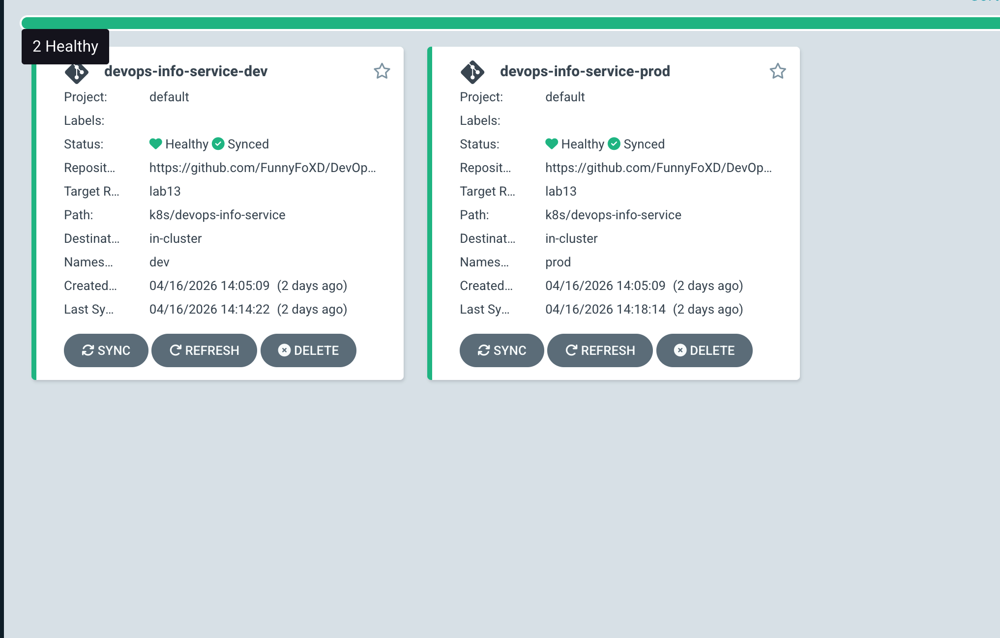
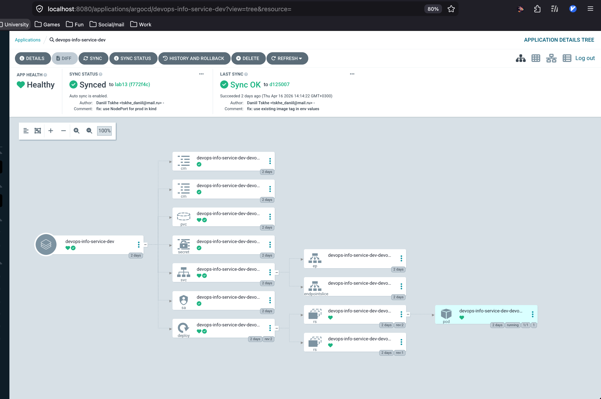
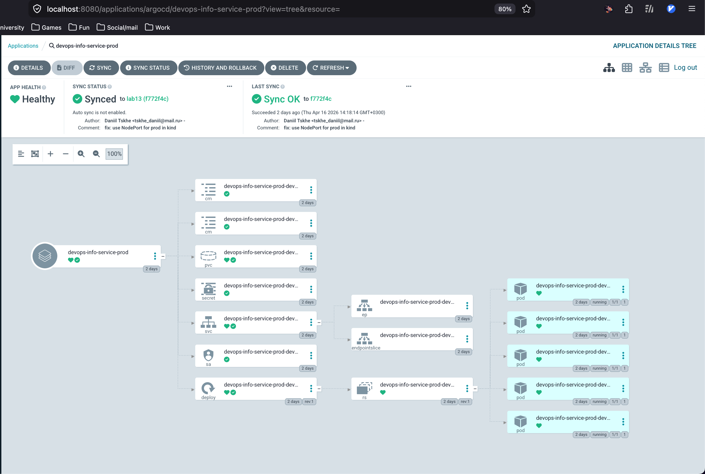
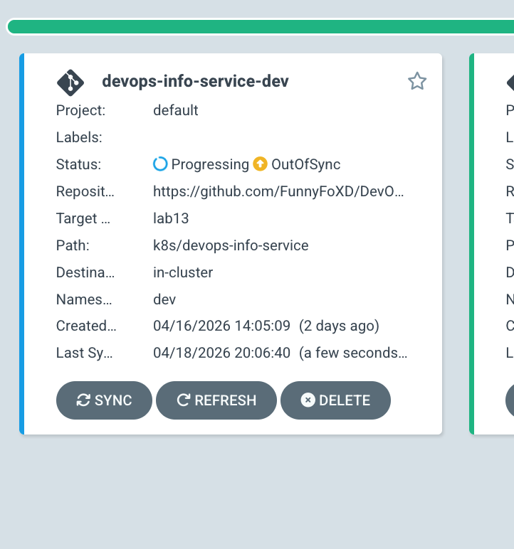
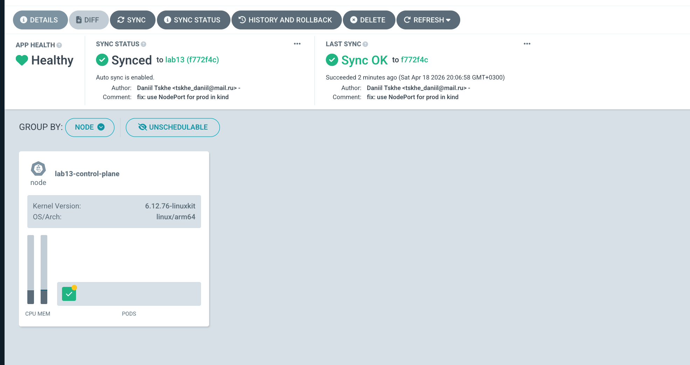
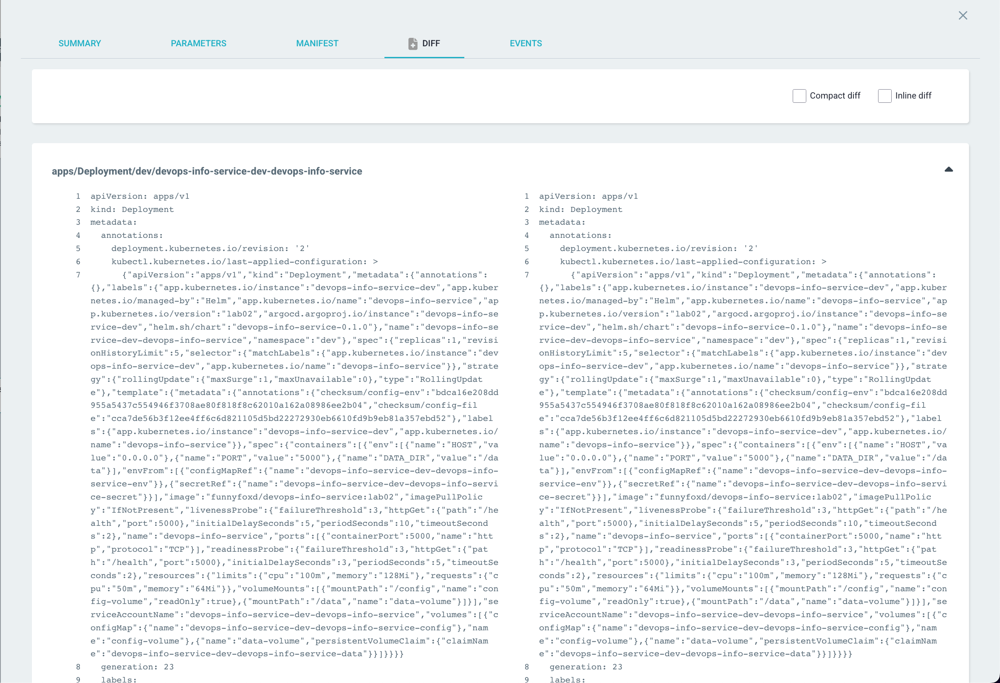
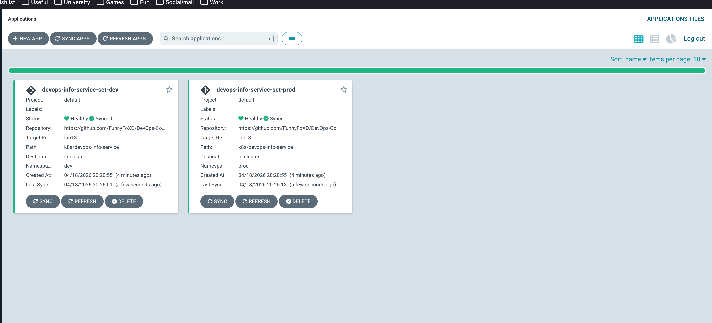

# Lab 13 — GitOps with ArgoCD (Report)

This lab deploys the existing Helm chart (`k8s/devops-info-service`) via ArgoCD as the single source of truth (GitOps).

## 1) ArgoCD Setup

### Install via Helm

```bash
helm repo add argo https://argoproj.github.io/argo-helm
helm repo update

kubectl create namespace argocd
helm install argocd argo/argo-cd --namespace argocd

kubectl wait --for=condition=ready pod -l app.kubernetes.io/name=argocd-server -n argocd --timeout=180s
```

For a **kind** cluster, this repo also keeps example overrides in `k8s/argocd/argocd-kind-values.yaml` (image registry tags, Dex image) so installs match a local environment. Adjust or merge those values with `helm install` / `helm upgrade` as needed.

### Access UI

```bash
kubectl port-forward svc/argocd-server -n argocd 8080:443
```

Get the initial password:

```bash
kubectl -n argocd get secret argocd-initial-admin-secret -o jsonpath="{.data.password}" | base64 -d; echo
```

Login:
- URL: `https://localhost:8080`
- Username: `admin`
- Password: from the command above

### Install & configure CLI

```bash
# macOS
brew install argocd

# Log in once (required before `argocd app diff` / `argocd app get`)
argocd login localhost:8080 --insecure --username admin
# or non-interactive:
# ARGOCD_PASSWORD="$(kubectl -n argocd get secret argocd-initial-admin-secret -o jsonpath='{.data.password}' | base64 -d)" \
#   argocd login localhost:8080 --insecure --username admin --password "$ARGOCD_PASSWORD"

argocd version
argocd app list
```

If you see `Argo CD server address unspecified`, run `argocd login ...` first, or pass `--server localhost:8080` to one-off commands.

### Evidence (screenshots)

UI access and the applications overview are shown in **§3** (first screenshot) and in the **§5** table.

## 2) Application configuration (single environment)

### Manifest

Application manifest is stored in `k8s/argocd/application.yaml`.

Key settings:
- Source repo: `https://github.com/FunnyFoXD/DevOps-Core-Course.git`
- Revision: `lab13`
- Chart path: `k8s/devops-info-service`
- Values: `values.yaml`
- Destination namespace: `default`
- Sync: manual

### Deploy & sync

```bash
kubectl apply -f k8s/argocd/application.yaml

argocd app get devops-info-service
argocd app sync devops-info-service
```

### Evidence

- For this course, multi-env apps are used below; optional single-app manifest: `k8s/argocd/application.yaml`.

### GitOps workflow (edit chart in Git)

Lab task 2 also asks to change the Helm chart in Git, push, and sync. Equivalent behavior is covered in two ways:

1. **Git-first workflow:** edit `k8s/devops-info-service/values-*.yaml` or templates, commit, push to `lab13`, click **Refresh** in Argo CD (or wait for the poll interval), then **Sync** (prod) or let auto-sync apply (dev).
2. **Drift demo:** manual `kubectl scale` in §4 makes the cluster differ from Git; with **self-heal** on dev, Argo CD reconciles back to the Git-defined replica count—same idea as “detect drift → align to Git,” but triggered from the cluster side.

## 3) Multi-environment (dev/prod)

### Namespaces

ArgoCD manifests include `CreateNamespace=true`, but you can also create namespaces explicitly:

```bash
kubectl create namespace dev
kubectl create namespace prod
```

### Environment-specific Applications

Manifests are stored in `k8s/argocd/`:
- `application-dev.yaml` uses `values-dev.yaml` and deploys to namespace `dev`
- `application-prod.yaml` uses `values-prod.yaml` and deploys to namespace `prod`

Apply:

```bash
kubectl apply -f k8s/argocd/application-dev.yaml
kubectl apply -f k8s/argocd/application-prod.yaml

argocd app list
```

### Sync policy differences and rationale

- Dev (`devops-info-service-dev`): **auto-sync enabled**
  - `selfHeal: true`: revert out-of-band cluster changes back to Git state
  - `prune: true`: delete resources removed from Git
  - Rationale: fast feedback, continuous delivery, safe to auto-correct drift

- Prod (`devops-info-service-prod`): **manual sync**
  - No `automated` block
  - Rationale: change review, controlled rollout timing, safer operations and compliance needs

### Verification

```bash
kubectl get all -n dev
kubectl get all -n prod

argocd app get devops-info-service-dev
argocd app get devops-info-service-prod
```

### Evidence (screenshots)

**Both apps in the list (dev + prod)**



**Dev** — application details (sync/health, resource tree)



**Prod** — application details



Replica/resource differences match `values-dev.yaml` (1 replica, smaller limits) vs `values-prod.yaml` (5 replicas, larger limits); visible in details / live manifest.

## 4) Self-healing & drift tests (dev)

### 4.1 Manual scale drift (ArgoCD self-heal)

1) Record current state:

```bash
kubectl get deploy -n dev
argocd app get devops-info-service-dev
```

2) Create drift:

```bash
kubectl scale deployment -n dev -l app.kubernetes.io/instance=devops-info-service-dev --replicas=5
```

3) Observe revert:

```bash
kubectl get pods -n dev -w
argocd app diff devops-info-service-dev
```

Evidence (screenshot):



After auto-sync/self-heal, the app returns to **Synced** and replica count matches Git (`values-dev.yaml`).

Fill in optional timestamps if your instructor asks for them:
- Before scale: (see UI / `kubectl get deploy -n dev`)
- After scale: (OutOfSync moment — screenshot above)
- Reverted by ArgoCD: (when status returns to Synced)

### 4.2 Pod deletion (Kubernetes self-heal)

```bash
kubectl delete pod -n dev -l app.kubernetes.io/instance=devops-info-service-dev
kubectl get pods -n dev -w
```

Notes:
- Kubernetes recreates pods to satisfy Deployment/ReplicaSet desired state.
- This is **not** ArgoCD drift correction; it’s Kubernetes controller behavior.

Evidence (screenshot after `kubectl delete pod ...` — new pod age / name):



### 4.3 Configuration drift (ArgoCD diff + self-heal)

Example: add a label to the Deployment:

```bash
kubectl label deployment -n dev -l app.kubernetes.io/instance=devops-info-service-dev lab13-drift=true --overwrite
argocd app diff devops-info-service-dev
```

With `selfHeal: true`, ArgoCD should revert the change back to Git-defined manifests.

Evidence (**App Diff** UI or CLI while OutOfSync / after disabling self-heal briefly):



### 4.4 When does ArgoCD sync vs Kubernetes heals?

- Kubernetes heals when: a managed object (like a Pod) disappears or diverges from its controller’s desired state.
- ArgoCD syncs when: Git desired state differs from the live cluster state (drift), on polling interval or via webhooks/manual sync.

Default Git polling interval (typical): ~3 minutes (can vary by config).

## Bonus — ApplicationSet

To generate both environments from a single declarative resource, `k8s/argocd/applicationset.yaml` uses a **List generator** with `goTemplate` enabled.

### Steps

1. Point `kubectl` at the right cluster; keep UI port-forward running if you use the web UI.

2. Apply the manifest:

```bash
kubectl apply -f k8s/argocd/applicationset.yaml
```

3. Verify the ApplicationSet and generated Applications:

```bash
kubectl get applicationsets.argoproj.io -n argocd
kubectl get applications.argoproj.io -n argocd | rg 'set-'
```

Expected app names: `devops-info-service-set-dev`, `devops-info-service-set-prod`.

4. **UI:** open **Applications**. After applying the ApplicationSet you should see `devops-info-service-set-dev` and `devops-info-service-set-prod` (and optionally the older `devops-info-service-*` apps if you did not delete them yet). Screenshot the list.



5. Optional: if your Argo CD version shows **ApplicationSets** in the left menu, open `devops-info-service-set` and screenshot.

6. **Note:** with both the manual `Application` objects and the ApplicationSet active, you may have **two Helm releases** of the same chart in `dev`/`prod` (different Application names). For a “clean” bonus demo, some instructors prefer deleting the old Applications first—ask your course staff. For the report, a list screenshot plus a short paragraph (below) is usually enough.

Notes:
- It generates `devops-info-service-set-dev` and `devops-info-service-set-prod`.
- Dev gets `automated` sync policy (auto-sync + prune + self-heal).
- Prod stays manual (no `automated` block).

**One paragraph for the report:** ApplicationSet gives one template + generators (list/matrix/git/cluster) instead of duplicating `Application` YAML per environment; list is for explicit envs, git for repo discovery, cluster for multi-cluster.