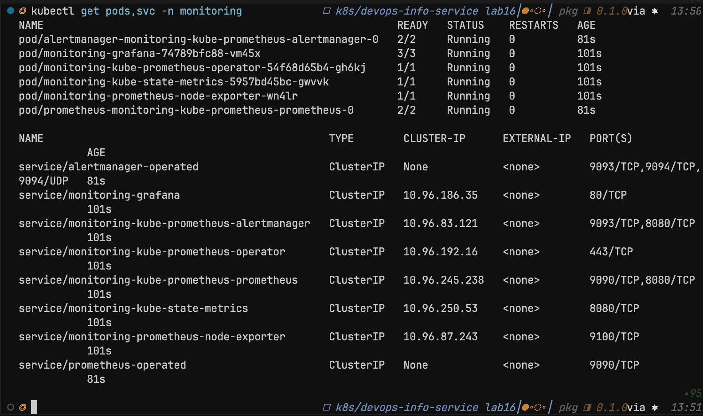
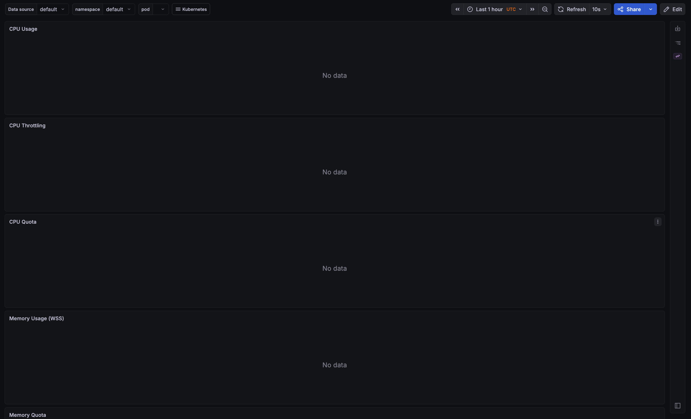
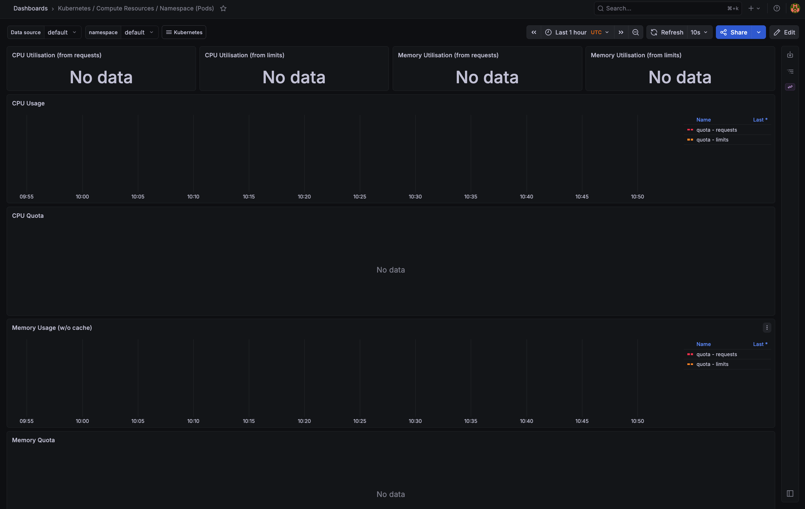
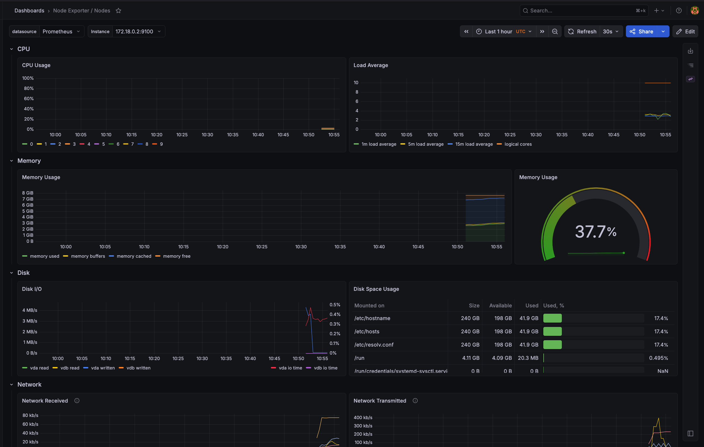
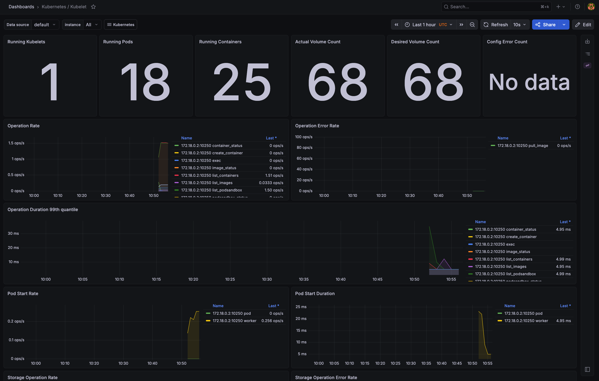
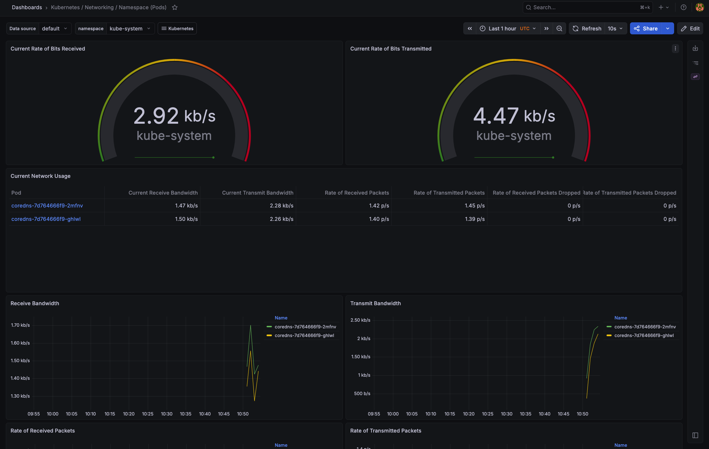
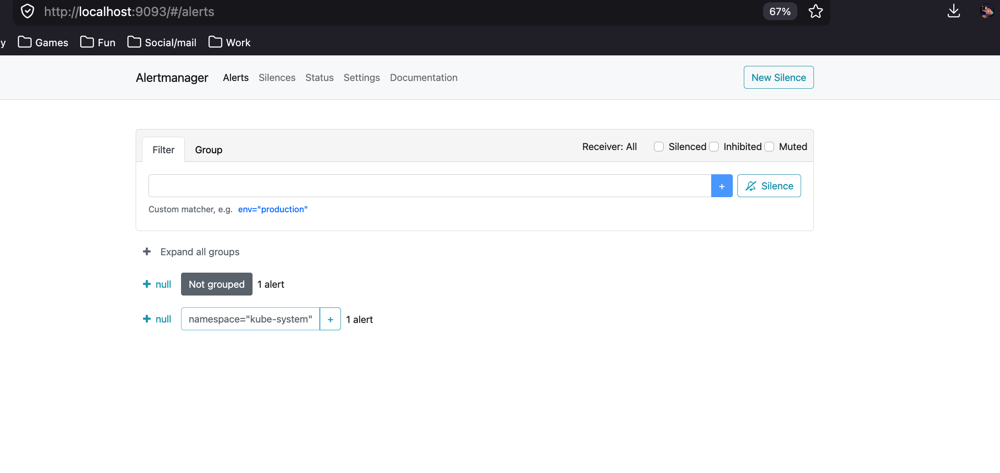
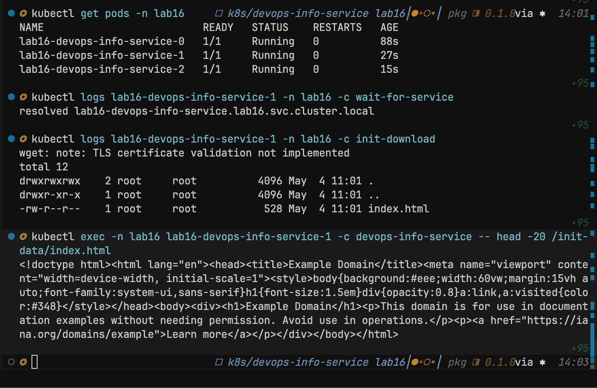
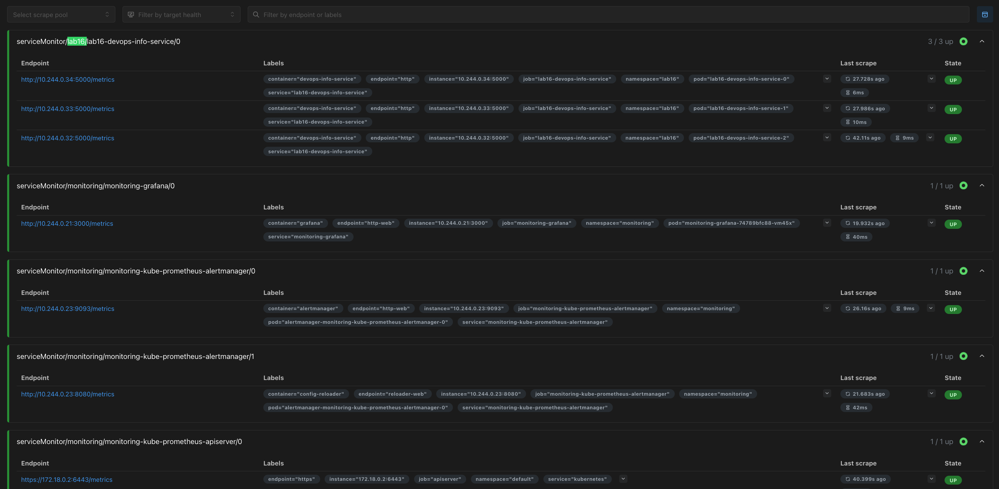

# Lab 16 — Kubernetes monitoring and init containers

Evidence screenshots live in **`k8s/screenshots/`** (`lab16_*.png`). This file ties them to each lab task.

## 1. Stack components (in short)

| Component | Role |
|-----------|------|
| **Prometheus Operator** | Watches `Prometheus`, `Alertmanager`, `ServiceMonitor`, `PodMonitor`, and related CRDs; reconciles desired monitoring configuration into running Prometheus and Alertmanager instances. |
| **Prometheus** | Time-series database and scraper: pulls metrics from targets (nodes, kubelet, cAdvisor, apps), stores samples, evaluates alerting rules. |
| **Alertmanager** | Receives alerts from Prometheus, groups, deduplicates, silences, and routes notifications (email, Slack, etc.). |
| **Grafana** | Dashboards and visualization; datasources typically include Prometheus for queries and exploration. |
| **kube-state-metrics** | Exposes **Kubernetes object state** as metrics (Pod phase, Deployment replicas, etc.) — not the same as cAdvisor container CPU. |
| **node-exporter** | DaemonSet exposing **host-level** metrics (CPU, memory, disk, network stacks) from each node. |

## 2. Installation (Task 1)

```bash
helm repo add prometheus-community https://prometheus-community.github.io/helm-charts
helm repo update

helm install monitoring prometheus-community/kube-prometheus-stack \
  --namespace monitoring \
  --create-namespace

kubectl get pods,svc -n monitoring
```

Grafana admin password (if needed):

```bash
kubectl get secret --namespace monitoring -l app.kubernetes.io/component=admin-secret \
  -o jsonpath="{.items[0].data.admin-password}" | base64 --decode ; echo
```

### 2.1 Installation evidence

Screenshot after workloads settled (**pods/services in `monitoring`**):



## 3. Grafana and Alertmanager (Task 2)

**Grafana:**

```bash
kubectl port-forward svc/monitoring-grafana -n monitoring 3000:80
# http://localhost:3000
```

**Alertmanager:**

```bash
kubectl port-forward svc/monitoring-kube-prometheus-alertmanager -n monitoring 9093:9093
# http://localhost:9093
```

**Prometheus (bonus / targets):**

```bash
kubectl port-forward svc/monitoring-kube-prometheus-prometheus -n monitoring 9090:9090
# http://localhost:9090
```

### 3.1 Dashboard questions — screenshots and answers

Dashboards used (typical kube-prometheus-stack bundle):

- **Kubernetes / Compute Resources / Namespace (Pods)** or **Pod**
- **Node Exporter / Nodes**
- **Kubernetes / Kubelet**
- Network-oriented pod/namespace views as available in the bundle

| # | Question | Evidence |
|---|----------|----------|
| 1 | **Pod resources** — CPU/memory for the StatefulSet workloads |  |
| 2 | **Namespace analysis** — which pods use most/least CPU (e.g. `default` or chosen namespace) |  |
| 3 | **Node metrics** — memory (% / absolute), CPU cores / utilization |  |
| 4 | **Kubelet** — pods/containers managed |  |
| 5 | **Network** — traffic for pods in the selected namespace |  |
| 6 | **Alerts** — active alerts in Alertmanager |  |

Exact numeric answers at capture time are visible on the screenshots (tables and legends).

## 4. Init containers (Task 3)

Implemented in the Helm chart (`initContainers` in `values.yaml`, enabled via **`values-lab16.yaml`**): **`wait-for-service`** (`nslookup` until the app Service DNS resolves) and **`init-download`** (`wget` into a shared `emptyDir`, app reads **`/init-data`**).

**Deploy example (StatefulSet, namespace `lab16`):**

```bash
cd k8s/devops-info-service
helm upgrade --install lab16 . \
  -f values-statefulset.yaml \
  -f values-lab16.yaml \
  -n lab16 --create-namespace
```

**kind + local image** (avoids NodePort **30080** clashes and uses an image with **`/metrics`**):

```bash
# docker build -t devops-info-service:lab16-metrics app_python
# kind load docker-image devops-info-service:lab16-metrics --name <cluster>
helm upgrade --install lab16 . \
  -f values-statefulset.yaml \
  -f values-lab16.yaml \
  -f values-lab16-kind-local.yaml \
  -n lab16 --create-namespace
```

`values-lab16.yaml` sets **`service.type: ClusterIP`** so the chart does not require a free NodePort.

### 4.1 Verification evidence

Commands used (see terminal in screenshot): `kubectl get pods`, init container logs (`wait-for-service`, `init-download`), and reading **`/init-data/index.html`** in the app container.



## 5. Bonus: `/metrics` and ServiceMonitor

The app exposes **`GET /metrics`** (`prometheus_client` in `app_python/app.py`). **`values-lab16.yaml`** enables a **`ServiceMonitor`** with label **`release: monitoring`** (matches the `helm install monitoring ...` release name).

The ServiceMonitor template excludes the **headless** Service (`matchExpressions`: `app.kubernetes.io/component` **DoesNotExist**) so each pod is scraped **once**, not via both ClusterIP and headless Services.

**Local image:** older tag **`funnyfoxd/devops-info-service:lab02`** returned **404** on `/metrics`; rebuild from `app_python` and use **`values-lab16-kind-local.yaml`** as above.

### 5.1 Prometheus targets



Example query in **Graph**:

```promql
http_requests_total{namespace="lab16"}
```

## 6. Checklist (lab)

- [x] Prometheus stack installed in `monitoring`
- [x] Six dashboard / Alertmanager questions documented with screenshots
- [x] Init: wget + shared volume + main container reads file
- [x] Init: wait-for-service before app container
- [x] Bonus: ServiceMonitor; Prometheus targets **UP** for `devops-info-service` (after image + ServiceMonitor fix)

---

**References:** [kube-prometheus-stack](https://github.com/prometheus-community/helm-charts/tree/main/charts/kube-prometheus-stack), [Init containers](https://kubernetes.io/docs/concepts/workloads/pods/init-containers/), [ServiceMonitor](https://prometheus-operator.dev/docs/user-guides/getting-started/).
