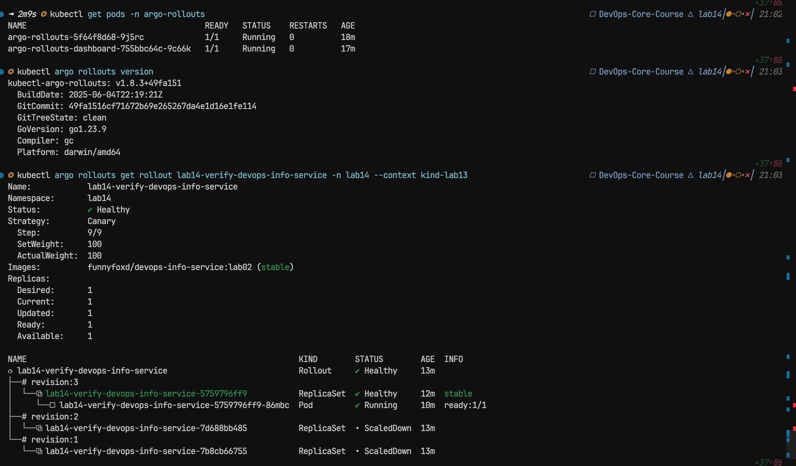
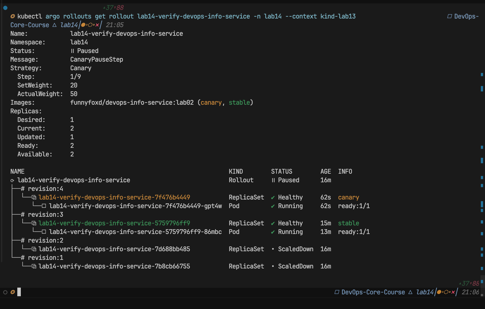
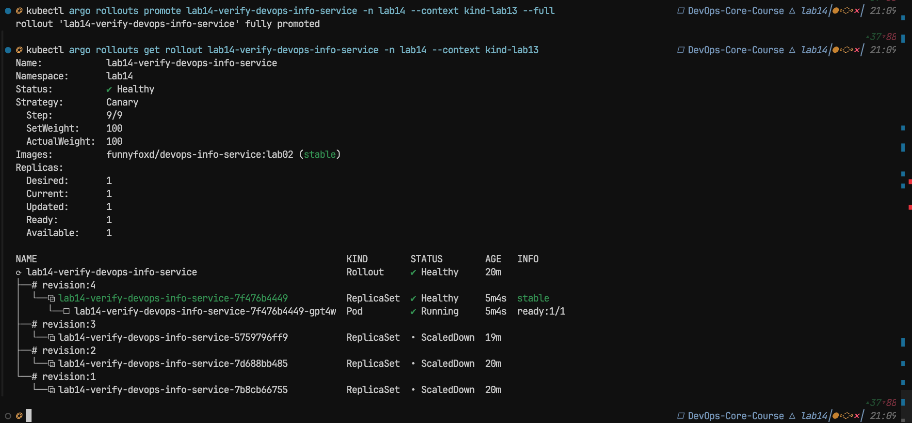
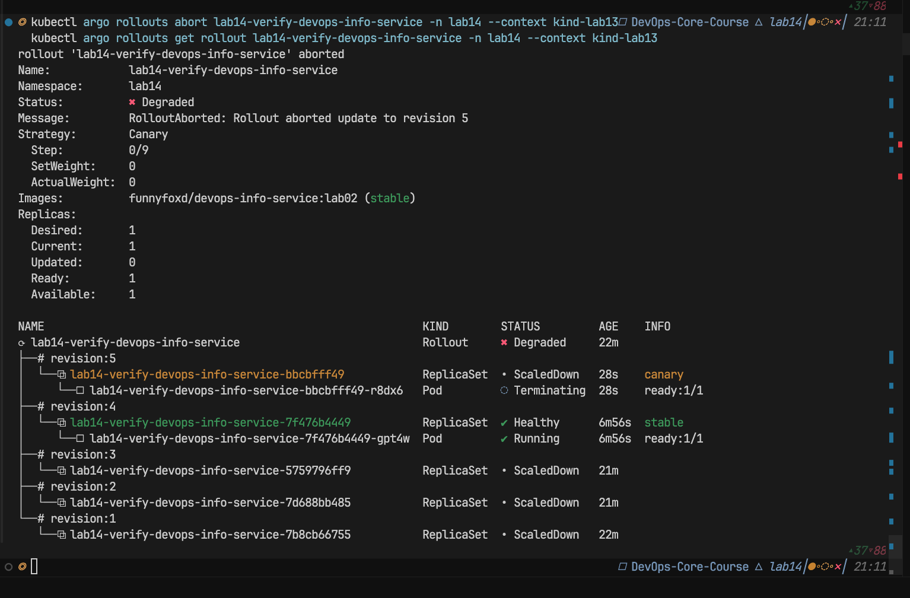
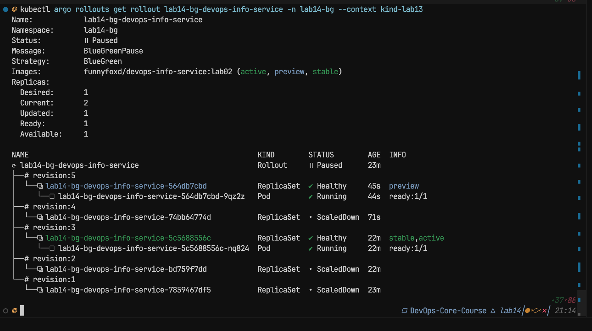
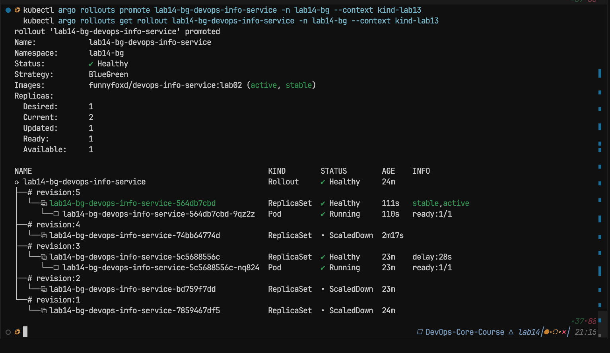

# Lab 14 — Progressive Delivery (Argo Rollouts)

Validation was run on **kind** using context `kind-lab13` (same cluster as Lab 13). Run date: **2026-04-18**.

### Evidence screenshots

Files: `k8s/screenshots/lab14_*.png`.

**Install — controller pods and kubectl plugin**



**Canary — manual pause after first weight (Paused, CanaryPauseStep, step 1/9)**



**Canary — rollout complete (Healthy, 9/9, 100%)**



**Canary — abort (Degraded, RolloutAborted)**



**Blue-green — before promote (Paused, BlueGreenPause; preview vs stable,active)**



**Blue-green — after promote (Healthy; new revision stable,active)**



---

## 1. Installing Argo Rollouts

### 1.1 Controller and CRDs

```bash
kubectl create namespace argo-rollouts --dry-run=client -o yaml | kubectl apply -f -
kubectl apply -n argo-rollouts -f https://github.com/argoproj/argo-rollouts/releases/latest/download/install.yaml
```

Verification (controller and dashboard in `Running`):

```text
$ kubectl get pods -n argo-rollouts
NAME                                       READY   STATUS    RESTARTS   AGE
argo-rollouts-5f64f8d68-9j5rc              1/1     Running   0          ...
argo-rollouts-dashboard-755bbc64c-9c66k    1/1     Running   0          ...
```

Image versions observed in the cluster:

```text
$ kubectl get deploy -n argo-rollouts -o custom-columns=NAME:.metadata.name,IMAGE:.spec.template.spec.containers[0].image
NAME                      IMAGE
argo-rollouts             quay.io/argoproj/argo-rollouts:v1.9.0
argo-rollouts-dashboard   quay.io/argoproj/kubectl-argo-rollouts:v1.9.0
```

Rollout CRD API version:

```text
$ kubectl get crd rollouts.argoproj.io -o jsonpath='{.spec.versions[0].name}{"\n"}'
v1alpha1
```

### 1.2 kubectl plugin (`kubectl argo rollouts`)

Recommended: `brew install argoproj/tap/kubectl-argo-rollouts`.

Version check (example output from validation):

```text
$ kubectl argo rollouts version
kubectl-argo-rollouts: v1.9.0+838d4e7
  ...
  Platform: darwin/arm64
```

### 1.3 Dashboard

Install the in-cluster dashboard (Lab 14 install manifest):

```bash
kubectl apply -n argo-rollouts -f https://github.com/argoproj/argo-rollouts/releases/latest/download/dashboard-install.yaml
```

**Recommended way to use the UI (avoids “infinite loading” with port-forward):** run the dashboard **on your machine** with the kubectl plugin. It uses your kubeconfig and talks to the API server directly (same binary as the container, but the networking path is simpler):

```bash
kubectl argo rollouts dashboard --context kind-lab13
# default: http://localhost:3100/rollouts  (see the line printed in the terminal)
```

Use another port if something already listens on 3100 (e.g. an old port-forward):

```bash
kubectl argo rollouts dashboard --context kind-lab13 --port 3101
# open http://localhost:3101/rollouts
```

Stop any **`kubectl port-forward … argo-rollouts-dashboard`** before starting the local dashboard if you reuse port **3100**.

**gRPC log line right after startup (`dial tcp 0.0.0.0:3100: connect: connection refused`)**

This comes from a [known dashboard bug](https://github.com/argoproj/argo-rollouts/issues/3931): the UI backend briefly tried to open a gRPC client to `0.0.0.0`, which is invalid. It is **fixed in v1.9.0** ([changelog](https://github.com/argoproj/argo-rollouts/releases/tag/v1.9.0), [PR #4589](https://github.com/argoproj/argo-rollouts/pull/4589)). You may still see the message **once** at startup due to a race—wait a few seconds, then **hard-refresh** the page (**Cmd+Shift+R** / Ctrl+F5) on **`http://localhost:3100/rollouts`**.

Confirm the plugin is current:

```bash
kubectl argo rollouts version
brew upgrade argoproj/tap/kubectl-argo-rollouts   # macOS
```

If the UI never works, use **CLI-only evidence** below — it is fully sufficient for the lab.

**Alternative (in-cluster + port-forward):**

```bash
kubectl port-forward svc/argo-rollouts-dashboard -n argo-rollouts 3100:3100
```

Then open **`http://localhost:3100/rollouts`** (not the site root). Some browsers still show endless loading here; if that happens, prefer **`kubectl argo rollouts dashboard`** above.

**If the page still never finishes loading**

1. Prefer **`kubectl argo rollouts dashboard`** instead of port-forward to the Service.
2. Use **http**, not **https**; try **http://127.0.0.1:3100/rollouts** instead of `localhost`.
3. Ensure at least one **`Rollout`** exists (`kubectl get rollout -A`). The upstream UI [can stay on “Loading” when there is nothing to list](https://github.com/argoproj/argo-rollouts/issues/3618).
4. Open DevTools -> **Network**: look for failed or pending API calls; **Console** for JavaScript errors.
5. Try a private/incognito window or disable ad-blockers for `localhost`.

### 1.4 Rollout vs Deployment

| Aspect | Deployment | Rollout (Argo Rollouts) |
|--------|------------|-------------------------|
| API | `apps/v1` | `argoproj.io/v1alpha1` |
| Strategy | RollingUpdate / Recreate | `canary` or `blueGreen` |
| Rollout control | `kubectl rollout` | `kubectl argo rollouts` (get / promote / abort / retry / undo) |
| GitOps | Standard manifest | Same manifest shape, but the Rollouts controller replaces Deployment |

---

## 2. Canary

### 2.1 Chart configuration

See [`devops-info-service/templates/rollout.yaml`](devops-info-service/templates/rollout.yaml); steps are in [`values.yaml`](devops-info-service/values.yaml) under `rollout.canary.steps`: 20% plus manual pause, then 40/60/80 with 30s pauses, then 100%.

### 2.2 Test deployment (namespace `lab14`)

To avoid clashing with NodePort **30080** already in use in the cluster, the Service uses **30082**. Use **`helm upgrade --install` without `--wait`**: otherwise Helm may wait a long time until the canary finishes (depends on Helm version and resource types).

```bash
helm upgrade --install lab14-verify ./k8s/devops-info-service \
  --namespace lab14 --create-namespace \
  --kube-context kind-lab13 \
  -f ./k8s/devops-info-service/values.yaml \
  -f ./k8s/devops-info-service/values-dev.yaml \
  --set service.nodePort=30082
```

Rollout name: **`lab14-verify-devops-info-service`**.

Trigger a new canary (pod template change via annotation):

```bash
helm upgrade lab14-verify ./k8s/devops-info-service -n lab14 --kube-context kind-lab13 \
  --reuse-values \
  --set podAnnotations.lab14-canary-demo="run-1"
```

If you use a Unix timestamp alone (`date +%s`), Helm treats it as a **number**; annotation values must be **strings**. Use **`--set-string`** or a non-numeric prefix, e.g. `--set-string podAnnotations.lab14-screenshot="$(date +%s)"` or `--set podAnnotations.lab14-screenshot="ts-$(date +%s)"`.

### 2.3 Pause on the first step and manual promote

Example output when the Rollout **waits for manual promote** after 20% (`CanaryPauseStep`, step 1/9):

```text
Name:            lab14-verify-devops-info-service
Namespace:       lab14
Status:          ॥ Paused
Message:         CanaryPauseStep
Strategy:        Canary
  Step:          1/9
  SetWeight:     20
  ActualWeight:  50
...
```

Commands:

```bash
kubectl argo rollouts get rollout lab14-verify-devops-info-service -n lab14 --context kind-lab13
kubectl argo rollouts promote lab14-verify-devops-info-service -n lab14 --context kind-lab13
kubectl argo rollouts promote lab14-verify-devops-info-service -n lab14 --context kind-lab13 --full
```

After a full promote: status **Healthy**, step **9/9**, weight **100%**.

### 2.4 Abort

During a canary (e.g. again after changing the annotation and pausing at step 1/9):

```bash
kubectl argo rollouts abort lab14-verify-devops-info-service -n lab14 --context kind-lab13
```

Right after abort: status **Degraded**, message `RolloutAborted`, stable revision stays on the previous ReplicaSet.

Recovering after abort:

```bash
kubectl argo rollouts retry rollout lab14-verify-devops-info-service -n lab14 --context kind-lab13
kubectl argo rollouts promote lab14-verify-devops-info-service -n lab14 --context kind-lab13 --full
```

---

## 3. Blue-green

### 3.1 Install with blue-green strategy

Separate release in namespace **`lab14-bg`**, active Service NodePort **30083** (avoids overlap with `dev` and `lab14`):

```bash
helm upgrade --install lab14-bg ./k8s/devops-info-service \
  --namespace lab14-bg --create-namespace \
  --kube-context kind-lab13 \
  -f ./k8s/devops-info-service/values.yaml \
  -f ./k8s/devops-info-service/values-dev.yaml \
  -f ./k8s/devops-info-service/values-bluegreen.yaml \
  --set service.nodePort=30083
```

Services:

```text
$ kubectl get svc -n lab14-bg
NAME                                      TYPE        CLUSTER-IP     PORT(S)
lab14-bg-devops-info-service              NodePort    ...            80:30083/TCP
lab14-bg-devops-info-service-preview      ClusterIP   ...            80/TCP
```

Rollout name: **`lab14-bg-devops-info-service`**. The chart sets `autoPromotionEnabled: false` — after a new revision appears you need **`kubectl argo rollouts promote`**.

### 3.2 Helm vs controller conflict (important)

On a **second `helm upgrade`** for the same blue-green release, Helm may hit a **server-side apply** error on `Service`: **argo-rollouts** already owns `spec.selector` (`conflict with "rollouts-controller"`). This is expected for blue-green.

**Practical workaround to demo a new revision without Helm:** patch the Rollout itself (pod template changes):

```bash
kubectl patch rollout lab14-bg-devops-info-service -n lab14-bg --type merge -p \
  "{\"spec\":{\"template\":{\"metadata\":{\"annotations\":{\"demo\":\"$(date +%s)\"}}}}}"
```

Then inspect revision tree and **preview** / **active** roles, then:

```bash
kubectl argo rollouts promote lab14-bg-devops-info-service -n lab14-bg --context kind-lab13
```

Example: before promote — status **Paused**, `BlueGreenPause`, ReplicaSets labeled **preview** and **stable,active**; after promote — new revision becomes **stable,active**.

Reach preview from your machine (ClusterIP):

```bash
kubectl port-forward svc/lab14-bg-devops-info-service-preview -n lab14-bg 8081:80
# curl http://127.0.0.1:8081/health
```

Active Service (NodePort on kind — or port-forward Service port 80):

```bash
kubectl port-forward svc/lab14-bg-devops-info-service -n lab14-bg 8080:80
```

### 3.3 Instant rollback (blue-green)

After promote, switching to the new version is effectively instant at the Service layer. Compared to canary: **abort** stops the stepwise rollout; for blue-green, rollback is usually a **rollback** to the previous Rollout revision or another rollout — document what you observe for your lab report.

---

## 4. Strategy comparison

| | Canary | Blue-green |
|---|--------|------------|
| Risk | Stepwise weights and pauses | Full stack on preview, then cutover |
| Resources | Often lower peak usage | Up to two full stacks during rollout |
| Typical use | Gradual exposure, SLO checks per step | Full pre-switch validation “like prod” |

**Practical note for this lab app:** canary is good for demonstrating pauses and stepwise **promote**; blue-green highlights the **preview Service** and a single **promote** for the whole version. In production, the choice depends on Ingress/service mesh and spare capacity.

---

## 5. CLI quick reference

```bash
kubectl argo rollouts get rollout <name> -n <ns> --context kind-lab13
kubectl argo rollouts get rollout <name> -n <ns> -w --context kind-lab13
kubectl argo rollouts promote <name> -n <ns> --context kind-lab13
kubectl argo rollouts promote <name> -n <ns> --full --context kind-lab13
kubectl argo rollouts abort <name> -n <ns> --context kind-lab13
kubectl argo rollouts retry rollout <name> -n <ns> --context kind-lab13
kubectl argo rollouts undo <name> -n <ns> --context kind-lab13
kubectl describe rollout <name> -n <ns>
```

---

## 6. Bonus — AnalysisTemplate

The template in [`devops-info-service/templates/analysis-template.yaml`](devops-info-service/templates/analysis-template.yaml) is rendered when `rollout.analysis.enabled: true`. Add an `analysis` step to `rollout.canary.steps` with `templateName` matching the resource name (e.g. `<release>-devops-info-service-health`). Success uses JSON field `status: healthy` from `/health`.

---

## Lab report evidence — terminal screenshots

The web dashboard is **optional**. For this course, **terminal output from `kubectl argo rollouts`** is valid, full proof of canary and blue-green behavior. PNGs for this run are saved under **`k8s/screenshots/`** and embedded in **[Evidence screenshots](#evidence-screenshots)** at the top of this document.

### Commands to run (adjust context/namespace if yours differ)

**Context:** `--context kind-lab13`  
**Canary Rollout (example from this repo):** `lab14-verify-devops-info-service` in namespace **`lab14`**.  
**Blue-green Rollout (example):** `lab14-bg-devops-info-service` in namespace **`lab14-bg`**.

Static snapshot (ASCII tree with steps, weights, ReplicaSets):

```bash
kubectl argo rollouts get rollout lab14-verify-devops-info-service -n lab14 --context kind-lab13
kubectl argo rollouts get rollout lab14-bg-devops-info-service -n lab14-bg --context kind-lab13
```

Live updates (press **Ctrl+C** to stop; good for showing Progressing / Paused changing over time):

```bash
kubectl argo rollouts get rollout lab14-verify-devops-info-service -n lab14 --context kind-lab13 -w
```

Tip: widen the terminal (or decrease font) so the tree fits without ugly wraps before you screenshot.

### Screenshot checklist (CLI-first)

| # | What to prove | When / how |
|---|----------------|------------|
| **1** | Argo Rollouts is installed | `kubectl get pods -n argo-rollouts` — controller (and optional dashboard pod) **Running** |
| **2** | Plugin works | `kubectl argo rollouts version` |
| **3** | **Canary — paused** waiting for manual step | After triggering a new rollout (e.g. Helm upgrade with a new `podAnnotations` value). Capture **`get rollout`** showing **Paused**, **CanaryPauseStep**, step **1/9**, canary + stable ReplicaSets |
| **4** | **Canary — after promote** | Same command after **`kubectl argo rollouts promote …`** (or **`--full`**) — **Healthy**, step **9/9**, weight **100%** |
| **5** | **Canary — abort** | After **`kubectl argo rollouts abort …`** — **Degraded**, `RolloutAborted`, traffic back on stable |
| **6** | **Blue-green — before promote** | **`get rollout`** in **`lab14-bg`** with new revision on **preview**, stable still **active** (tree labels **preview** / **stable,active**) |
| **7** | **Blue-green — after promote** | Same — new revision **stable,active** |
| **8** | *(Optional)* **Watch mode** | One screenshot of **`-w`** while status changes (Progressing -> Paused -> Healthy) |