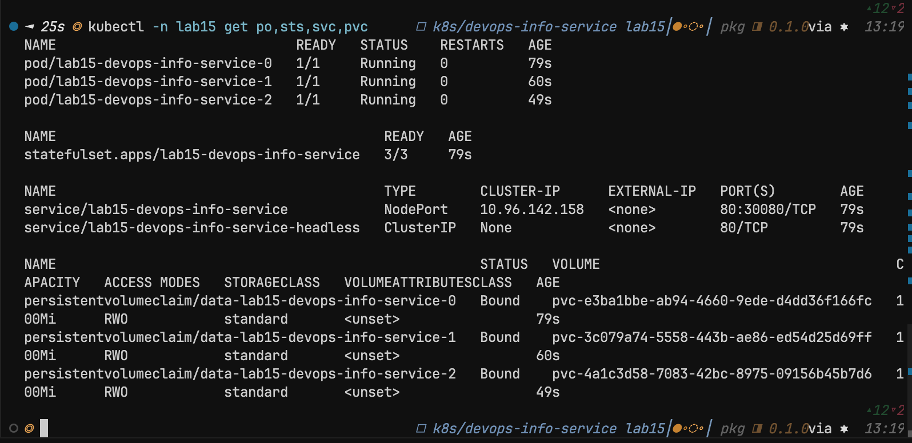
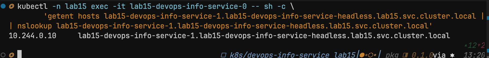
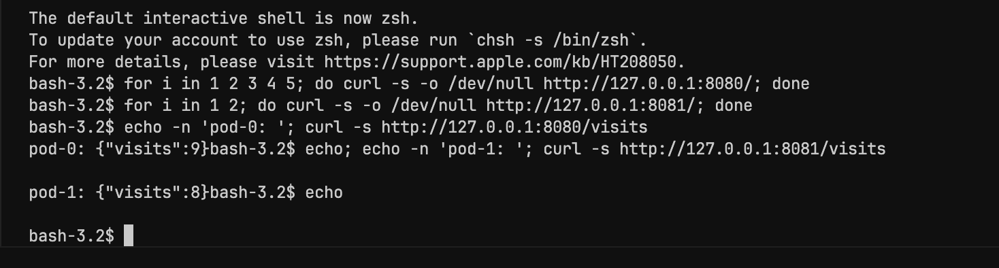
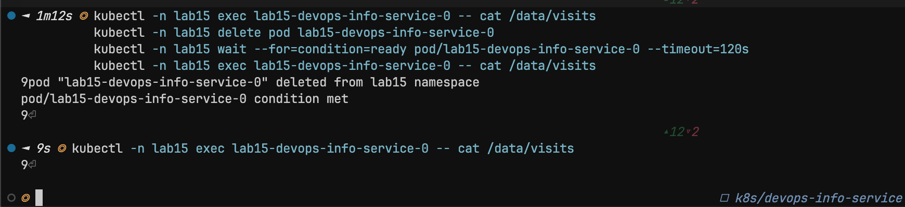

# Lab 15 — StatefulSet and persistent storage

This chart can run the app as an **Argo Rollout** (default) or as a **StatefulSet** with a **headless Service** and **per-pod PVCs** (`volumeClaimTemplates`). Switch with `statefulset.enabled` in `values.yaml` or use `values-statefulset.yaml`.

### Evidence screenshots

Files: `k8s/screenshots/lab15_*.png`. Cluster: **kind** (`lab15`), namespace **`lab15`**, release **`lab15`**.

**PVCs and workload** (`kubectl get` pods / StatefulSet / services / PVCs)



**DNS** — resolve peer pod via headless Service (`getent hosts` / FQDN)



**Per-pod visit counts** — port-forward to `-0` and `-1`, different `curl /visits` values



**Persistence** — `cat /data/visits` after deleting and recreating pod `-0`



---

## 1. StatefulSet overview

### 1.1 Why StatefulSet

A StatefulSet gives workloads that need **stable identity** and **stable storage** per replica:

- **Stable network IDs:** Pods are named `<statefulset-name>-0`, `-1`, … and keep those names across reschedules.
- **Stable storage:** `volumeClaimTemplates` create one PVC per pod; the same PVC is reattached when the pod is recreated.
- **Ordered operations:** Scale-up and rolling updates can proceed in ordinal order (configurable); scale-down is typically reverse order.

### 1.2 Deployment vs StatefulSet

| Aspect | Deployment | StatefulSet |
|--------|------------|-------------|
| Pod names | Random suffix | Ordered ordinals (`app-0`, `app-1`, …) |
| Storage | Often one shared PVC or none | Per-pod PVC via `volumeClaimTemplates` |
| Scaling order | Any | Ordered (and policies for parallel management) |
| Stable DNS per pod | Not by default | Yes, via headless Service + pod DNS |

**Use a Deployment** for stateless HTTP APIs, workers, and anything that does not depend on persistent per-instance data or stable hostname semantics.

**Use a StatefulSet** for databases, Kafka/ZooKeeper-style clusters, Elasticsearch nodes, and other systems where each replica has its own disk and address.

### 1.3 Headless Service (`clusterIP: None`)

A headless Service does not allocate a single cluster IP for load balancing. Instead, the Kubernetes DNS publishes **A/AAAA records per ready endpoint** (and sometimes per pod, depending on setup and `publishNotReadyAddresses`).

For a StatefulSet pod, the usual FQDN pattern is:

```text
<pod-name>.<headless-service-name>.<namespace>.svc.cluster.local
```

Example (release `lab15`, namespace `default`, chart default name):

- StatefulSet / pod prefix: `lab15-devops-info-service`
- Headless Service: `lab15-devops-info-service-headless`
- Pod `lab15-devops-info-service-0` resolves peers as  
  `lab15-devops-info-service-1.lab15-devops-info-service-headless.default.svc.cluster.local`

Short names inside the same namespace:  
`<pod-name>.<headless-service-name>`.

---

## 2. Deploy (Helm)

From `k8s/devops-info-service`:

```bash
helm upgrade --install lab15 . -f values-statefulset.yaml -n default --create-namespace
```

**Apple Silicon kind:** public images tagged only for `linux/amd64` often fail with `no match for platform in manifest`. Build **arm64** locally, load into the cluster, and add `values-statefulset-kind-local.yaml`:

```bash
docker build --platform linux/arm64 -t devops-info-service:lab15-local -f ../../app_python/Dockerfile ../../app_python
kind load docker-image devops-info-service:lab15-local --name lab15
helm upgrade --install lab15 . -f values-statefulset.yaml -f values-statefulset-kind-local.yaml -n lab15 --create-namespace
```

Key settings:

- `statefulset.enabled: true` — renders **StatefulSet** + **headless Service**; **Rollout** and the shared **PVC** `*-data` are not rendered (data is per-pod via `volumeClaimTemplates`).
- `persistence.size` and `persistence.storageClass` control each pod’s PVC.

To try **bonus** update strategies, edit `values-statefulset.yaml` (or override on the CLI):

- **Partitioned rolling update:** `statefulset.updateStrategy: RollingUpdate` and `statefulset.partition: N` — only pods with ordinal **≥ N** get the new revision first ([StatefulSet update strategies](https://kubernetes.io/docs/concepts/workloads/controllers/statefulset/#update-strategies)).
- **OnDelete:** `statefulset.updateStrategy: OnDelete` — the controller does not replace pods automatically; delete a pod manually to pick up a new spec. Useful when you must coordinate restarts with an operator or external process.

---

## 3. Resource verification

After install, capture cluster state (adjust release name and namespace):

```bash
kubectl get po,sts,svc,pvc -l app.kubernetes.io/instance=lab15
```

**Example shape** (three replicas, release `lab15`, namespace `default`):

```text
NAME                                          READY   STATUS    RESTARTS   AGE
pod/lab15-devops-info-service-0               1/1     Running   0          ...
pod/lab15-devops-info-service-1               1/1     Running   0          ...
pod/lab15-devops-info-service-2               1/1     Running   0          ...

NAME                                   READY   AGE
statefulset.apps/lab15-devops-info-service   3/3     ...

NAME                                  TYPE        CLUSTER-IP     PORT(S)
service/lab15-devops-info-service      NodePort    10.96.x.x      80:30080/TCP
service/lab15-devops-info-service-headless   ClusterIP   None     80/TCP

NAME                                                                  STATUS   VOLUME
persistentvolumeclaim/data-lab15-devops-info-service-0                Bound    ...
persistentvolumeclaim/data-lab15-devops-info-service-1                Bound    ...
persistentvolumeclaim/data-lab15-devops-info-service-2                Bound    ...
```

PVC names follow Kubernetes naming: `data-<statefulset-name>-<ordinal>` when the volume claim template metadata name is `data`.

---

## 4. Network identity (DNS)

From any pod in the set:

```bash
kubectl exec -it lab15-devops-info-service-0 -- sh -c 'nslookup lab15-devops-info-service-1.lab15-devops-info-service-headless.default.svc.cluster.local || getent hosts lab15-devops-info-service-1.lab15-devops-info-service-headless'
```

**Expected:** a record pointing at the other pod’s IP (image must include `nslookup`/`bind-tools` or use `getent` on musl/glibc).

**Pattern documented:**  
`<statefulset-pod>.<headless-svc>.<ns>.svc.cluster.local`.

---

## 5. Per-pod storage (visit counter)

The app stores visit data under `DATA_DIR` (default mount: `/data`). With StatefulSet + `volumeClaimTemplates`, **each pod has its own PVC**, so counters diverge when you hit **individual pods**.

Port-forward two pods and call `/visits` (container port `5000`, Service port is `80` — use target port when forwarding to the pod):

```bash
kubectl port-forward pod/lab15-devops-info-service-0 8080:5000 &
kubectl port-forward pod/lab15-devops-info-service-1 8081:5000 &
curl -s localhost:8080/visits
curl -s localhost:8081/visits
```

**Evidence:** after several requests to each URL, the two JSON bodies show **different** counts — isolation per pod.

---

## 6. Persistence across pod delete

Note the count for pod `…-0`, then delete **only the pod** (not the StatefulSet):

```bash
kubectl exec lab15-devops-info-service-0 -- cat /data/visits
kubectl delete pod lab15-devops-info-service-0
# wait until StatefulSet recreates -0
kubectl wait --for=condition=ready pod/lab15-devops-info-service-0 --timeout=120s
kubectl exec lab15-devops-info-service-0 -- cat /data/visits
```

**Expected:** the file content matches the pre-delete value — the **same PVC** was reattached to the new `…-0` pod.

---

## 7. Files added or changed in the chart

| File | Purpose |
|------|---------|
| `templates/statefulset.yaml` | StatefulSet, `serviceName`, optional `volumeClaimTemplates` |
| `templates/service-headless.yaml` | Headless Service for stable pod DNS |
| `templates/rollout.yaml` | Wrapped: rendered only if `statefulset.enabled` is false |
| `templates/pvc.yaml` | Shared PVC only when **not** using StatefulSet persistence templates |
| `values.yaml` | `statefulset.*` defaults |
| `values-statefulset.yaml` | Lab profile: `replicaCount: 3`, `statefulset.enabled: true` |

---

## 8. Bonus — update strategies (summary)

| `statefulset.updateStrategy` | Behavior |
|------------------------------|----------|
| `RollingUpdate` + `partition: 0` | Standard rolling update to all pods. |
| `RollingUpdate` + `partition: K` | Pods with ordinal **< K** stay on the old revision until partition is lowered; ordinals **≥ K** update first. |
| `OnDelete` | Controller does not recreate pods on spec change; **manually delete** a pod to apply the new template. Useful for strict operational control or paired maintenance windows. |

---

*Replace example names (`lab15`, `default`) with your release and namespace when capturing evidence for submission.*
