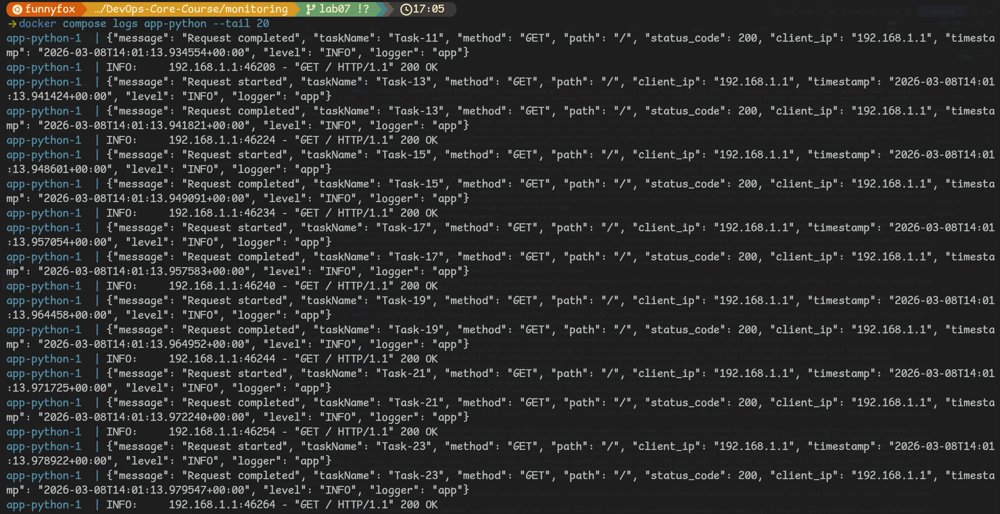
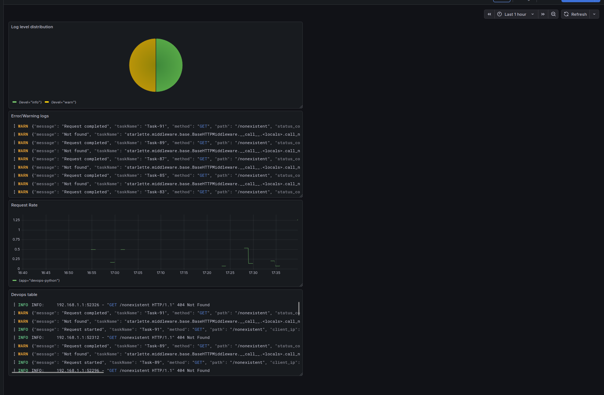
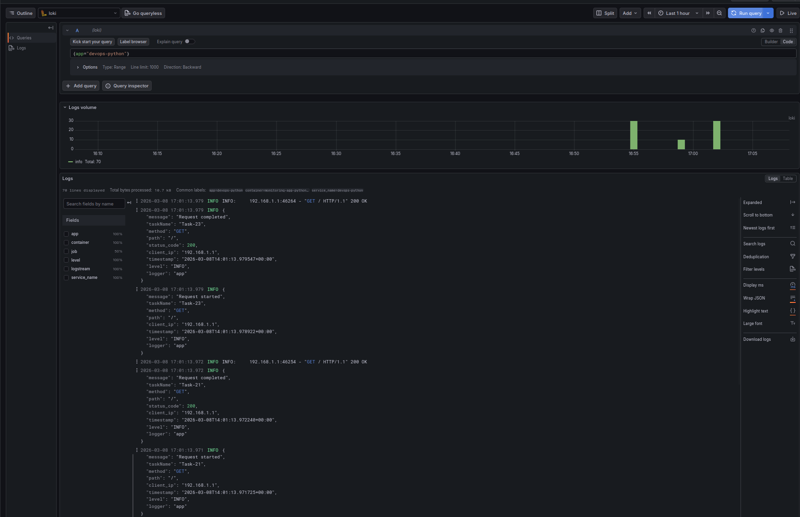
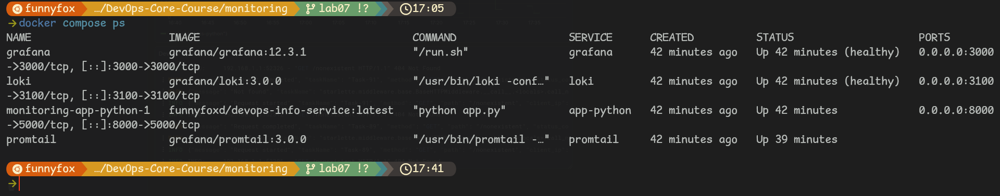
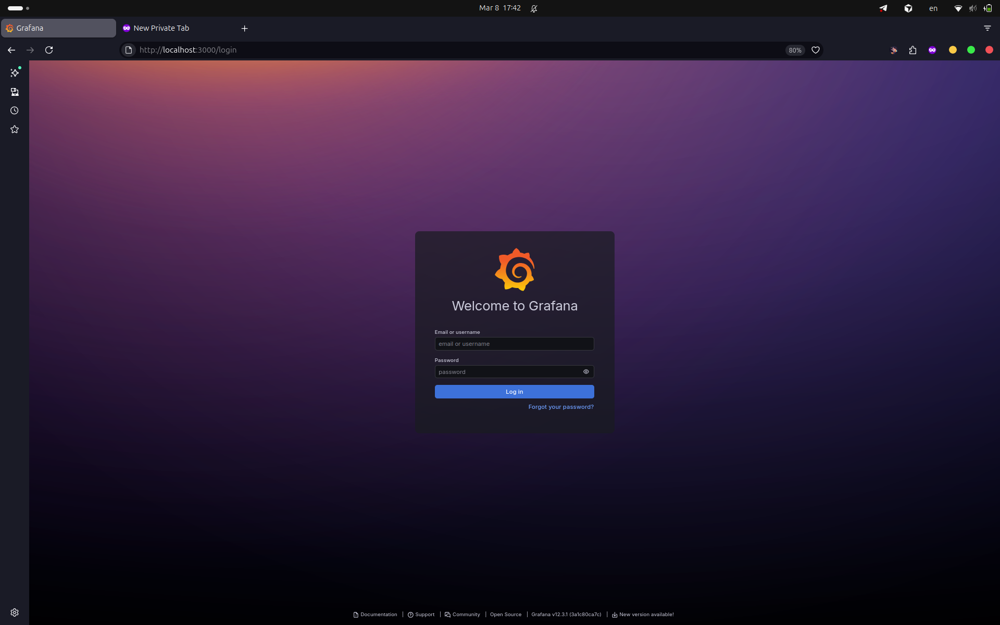
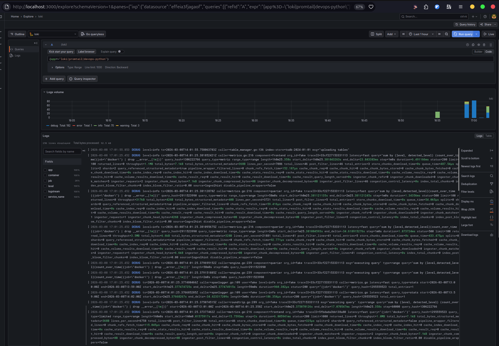

# Lab 7 — Observability & Logging with Loki Stack

Documentation for the Loki + Promtail + Grafana logging stack and application integration.

---

## 1. Architecture

The stack aggregates logs from containerized applications and stores them in Loki for querying in Grafana.

```
┌──────────────┐     ┌─────────────┐     ┌─────────────┐     ┌──────────┐
│ app-python   │────►│  Promtail   │────►│    Loki     │◄────│ Grafana  │
│ :8000        │     │  :9080      │     │   :3100     │     │  :3000   │
└──────────────┘     └──────┬──────┘     └──────┬──────┘     └──────────┘
                            │                    │
                            │ /var/run/          │ TSDB + filesystem
                            │ docker.sock        │ retention 7 days
                            ▼                    ▼
                    Docker containers (label: logging=promtail)
                    → log streams with app, container, job labels
```

**Flow:** Applications write JSON logs to stdout → Docker captures them → Promtail discovers containers via Docker socket (filter: `logging=promtail`), adds labels, pushes to Loki → Loki stores (TSDB + filesystem), 7-day retention → Grafana queries via LogQL.

---

## 2. Setup Guide

**Prerequisites:** Docker and Docker Compose v2; Python app image `funnyfoxd/devops-info-service:latest`.

```bash
cd monitoring
# Optional: set Grafana admin password
# echo "GRAFANA_ADMIN_PASSWORD=your_password" > .env
docker compose up -d
docker compose ps
```

**Grafana:** Open http://localhost:3000 → **Connections** → **Data sources** → **Add data source** → **Loki** → URL: `http://loki:3100` → **Save & Test**. Then **Explore** → select Loki → query `{app="devops-python"}` to verify logs.

---

## 3. Configuration

**Loki** (`loki/config.yml`): HTTP port 3100; `common.path_prefix: /loki`; schema v13 with TSDB index and filesystem object store; `limits_config.retention_period: 168h` (7 days); compactor with `retention_enabled: true` and `delete_request_store: filesystem` (required for retention). No `storage_config.tsdb` block (not supported in this Loki 3.0 config shape).

**Promtail** (`promtail/config.yml`): Pushes to `http://loki:3100/loki/api/v1/push`; Docker service discovery on `unix:///var/run/docker.sock` with filter `label=logging=promtail`; relabel to set `job=docker`, `container` from container name, `app` from label; `pipeline_stages: docker: {}`.

---

## 4. Application Logging

The Python app was updated to emit **JSON structured logs** to stdout using `python-json-logger` and a custom `CustomJsonFormatter` that adds `timestamp`, `level`, `logger`, and optional `method`, `path`, `status_code`, `client_ip` from `logging` `extra`. Events logged: startup (host, port); each request (“Request started” / “Request completed” with method, path, status_code, client_ip); 404 via `logger.warning("Not found", ...)`; 500 via `logger.error(...)`.

**Example log line:**
```json
{"timestamp": "2026-03-08T14:00:00.000000+00:00", "level": "INFO", "message": "Request completed", "method": "GET", "path": "/", "status_code": 200, "client_ip": "192.168.1.1", "logger": "app"}
```

**Evidence — JSON log output from the app:**



---

## 5. Dashboard

Four panels were created in Grafana.

| Panel | Type | LogQL |
|-------|------|--------|
| Logs Table | Logs | `{app=~"devops-.*"}` |
| Request Rate | Time series | `sum by (app) (rate({app=~"devops-.*"} [1m]))` |
| Error Logs | Logs | `{app="devops-python"} \|= "WARNING"` or `\|= "Not found"` (404 logs) |
| Log Level Distribution | Stat / Pie | `sum by (level) (count_over_time({app=~"devops-.*"} \| json [5m]))` |

**Evidence — Dashboard with all 4 panels:**



**Example LogQL queries used:**
- `{app="devops-python"}` — all app logs
- `{app="devops-python"} \| json \| method="GET"` — GET requests only
- `{app="devops-python"} \| json \| level="info"` — INFO level (use lowercase `"info"` if stream label is lowercase)

**Evidence — Grafana Explore showing logs from the application:**



---

## 6. Production Config

- **Resource limits:** All services have `deploy.resources.limits` and `reservations` in `docker-compose.yml` (Loki, Promtail, Grafana, app-python).
- **Security:** Anonymous auth disabled (`GF_AUTH_ANONYMOUS_ENABLED=false`). Admin password via `GRAFANA_ADMIN_PASSWORD`; use `.env` (see `.env.example`) and do not commit `.env`.
- **Health checks:** Loki (`/ready`) and Grafana (`/api/health`) have `healthcheck` in compose.

**Evidence — All services healthy:**



**Evidence — Grafana login (no anonymous access):**



---

## 7. Testing

```bash
cd monitoring
docker compose ps
curl -s http://localhost:3100/ready
# Generate app logs
for i in $(seq 1 20); do curl -s http://localhost:8000/; done
for i in $(seq 1 20); do curl -s http://localhost:8000/health; done
```

In Grafana Explore (Loki): `{app="devops-python"}`, `{app="devops-python"} |= "WARNING"`, `{app="devops-python"} | json | method="GET"`.

**Evidence — Task 1.6: logs from at least 3 containers in Grafana Explore:**



---

## 8. Challenges

- **Loki 3.0 config:** `storage_config.tsdb` is not valid; removed it. When retention is enabled, `compactor.delete_request_store` must be set (e.g. `filesystem` with `delete_request_store_key_prefix: index/`).
- **Promtail:** Label `job` was not present in Loki; added explicit relabel `target_label: job`, `replacement: docker` so `{job="docker"}` works.
- **Grafana LogQL:** Filtering by `level` after `| json` can conflict with stream label `level` (e.g. lowercase `info`). Using line filters like `|= "WARNING"` or `|= "Not found"` for Error Logs panel avoided the issue. Time range must include when logs were written (e.g. Last 1 hour).
- **JSON logging:** 404 is logged as WARNING, not ERROR; middleware logs “Request completed” with status_code, so both 404 and 200 appear in logs.
