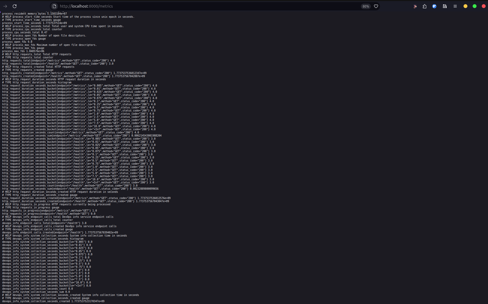
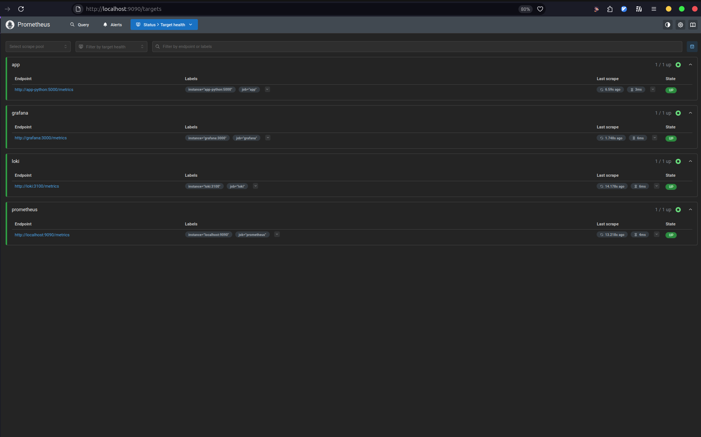
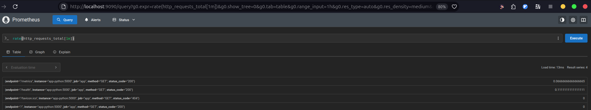
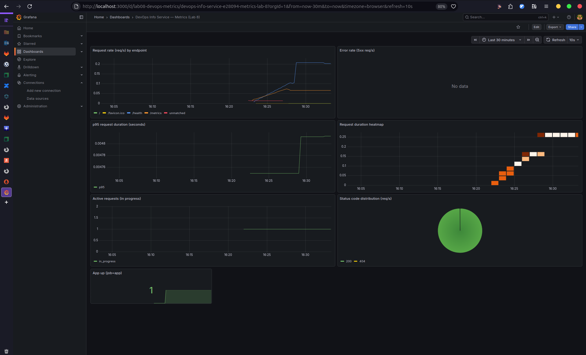
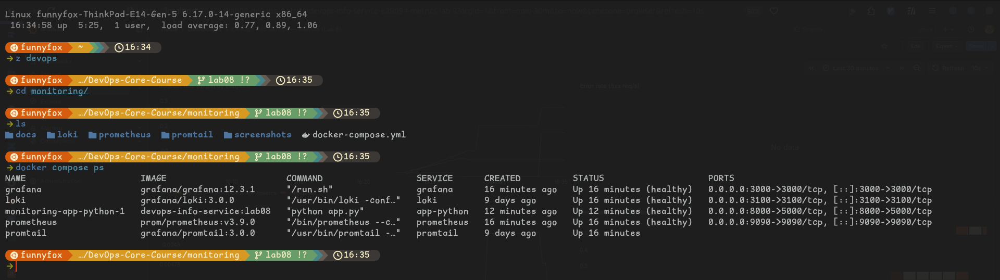

# Lab 8 — Metrics & Monitoring with Prometheus

Documentation for adding Prometheus metrics to the Python service and extending the Lab 7 observability stack with Prometheus + Grafana dashboards.

---

## 1. Architecture

```
            (metrics) scrape /metrics                (PromQL)
┌────────────────────┐      pull      ┌────────────────────┐      query      ┌────────────────────┐
│ app-python (:5000) │ <------------- │ prometheus (:9090) │ <-------------- │ grafana (:3000)    │
└────────────────────┘                └────────────────────┘                 └────────────────────┘

            (logs) stdout/json                         (LogQL)
┌────────────────────┐    push logs    ┌────────────────────┐      query      ┌────────────────────┐
│ promtail           │ ------------->  │ loki (:3100)       │ <-------------  │ grafana (:3000)    │
└────────────────────┘                 └────────────────────┘                 └────────────────────┘
```

**Flow:** the app exposes metrics at `/metrics` → Prometheus scrapes on schedule → Grafana queries Prometheus with PromQL and visualizes the RED method (Rate/Errors/Duration).

---

## 2. Application Instrumentation

### 2.1 Metrics added

**HTTP RED metrics:**
- **Counter** `http_requests_total{method,endpoint,status_code}` — total requests by route template (low cardinality), method and status.
- **Histogram** `http_request_duration_seconds{method,endpoint,status_code}` — request latency distribution per route/method/status.
- **Gauge** `http_requests_in_progress{method,endpoint}` — concurrent in-flight requests.

**App-specific metrics:**
- **Counter** `devops_info_endpoint_calls{endpoint}` — calls to `/` and `/health`.
- **Histogram** `devops_info_system_collection_seconds` — time spent collecting system info for the `/` response.

**Evidence — `/metrics` output:**



### 2.2 Implementation details

- `/metrics` is implemented as a FastAPI endpoint returning `prometheus_client.generate_latest()` with `CONTENT_TYPE_LATEST`.
- Instrumentation is implemented via a FastAPI/Starlette middleware:
  - increments in-progress gauge at request start
  - records duration and increments counters in `finally`, using labels:
    - `method` = HTTP method
    - `endpoint` = URL path (e.g. `/`, `/health`, `/metrics`)
    - `status_code` = response status or `500` for unhandled exceptions

---

## 3. Prometheus configuration

### 3.1 Docker Compose

`monitoring/docker-compose.yml` was extended with:
- **Prometheus** (`prom/prometheus:v3.9.0`) exposed on `localhost:9090`
- persistent volume `prometheus-data:/prometheus`
- retention policy flags:
  - `--storage.tsdb.retention.time=15d`
  - `--storage.tsdb.retention.size=10GB`
- health checks:
  - Prometheus: `/-/healthy`
  - App: `/health`
- resource limits tuned to the lab requirements (Grafana 512M/0.5 CPU, app 256M/0.5 CPU, Prometheus 1G/1 CPU)

### 3.2 Scrape targets

Config file: `monitoring/prometheus/prometheus.yml`

Targets/jobs:
- `prometheus`: `localhost:9090`
- `app`: `app-python:5000` (metrics path `/metrics`)
- `loki`: `loki:3100` (metrics path `/metrics`)
- `grafana`: `grafana:3000` (metrics path `/metrics`)

Global scrape interval: `15s`.

**Evidence — Prometheus targets/verification:**



**Evidence — PromQL query:**



---

## 4. Grafana dashboards

### 4.1 Prometheus data source

Grafana → **Connections** → **Data sources** → **Add data source** → **Prometheus**
- URL: `http://prometheus:9090`
- Save & Test

### 4.2 Dashboard panels (6+)

This dashboard is exported to `monitoring/docs/grafana-app-dashboard.json`.

Panels and their queries:
1. **Request Rate (req/s)**  
   `sum by (endpoint) (rate(http_requests_total[5m]))`
2. **Error Rate (5xx req/s)**  
   `sum(rate(http_requests_total{status_code=~"5.."}[5m]))`
3. **p95 Request Duration (seconds)**  
   `histogram_quantile(0.95, sum by (le) (rate(http_request_duration_seconds_bucket[5m])))`
4. **Request Duration Heatmap**  
   `sum by (le) (rate(http_request_duration_seconds_bucket[5m]))`
5. **Active Requests (in progress)**  
   `sum(http_requests_in_progress)`
6. **Status Code Distribution**  
   `sum by (status_code) (rate(http_requests_total[5m]))`
7. **App Uptime**  
   `up{job="app"}`

**Evidence — Grafana dashboard (6+ panels):**



---

## 5. PromQL examples (5+)

- **All targets up:** `up`
- **Requests per endpoint:** `sum by (endpoint) (rate(http_requests_total[5m]))`
- **4xx rate:** `sum(rate(http_requests_total{status_code=~"4.."}[5m]))`
- **5xx rate:** `sum(rate(http_requests_total{status_code=~"5.."}[5m]))`
- **p50 latency:** `histogram_quantile(0.50, sum by (le) (rate(http_request_duration_seconds_bucket[5m])))`
- **p95 latency:** `histogram_quantile(0.95, sum by (le) (rate(http_request_duration_seconds_bucket[5m])))`
- **System info collection time p95:** `histogram_quantile(0.95, rate(devops_info_system_collection_seconds_bucket[5m]))`

---

## 6. Production setup

- **Health checks:** Loki (`/ready`), Grafana (`/api/health`), Prometheus (`/-/healthy`), app (`/health`).
- **Resources:** `deploy.resources.limits` applied to services as per lab requirements.
- **Retention:** Prometheus retention time/size configured via CLI flags.
- **Persistence:** volumes `loki-data`, `grafana-data`, `prometheus-data` keep state after `docker compose down` / `up -d`.

**Evidence — Docker Compose services healthy:**



---

## 7. Testing results

Commands (manual verification):

```bash
cd monitoring
docker compose up -d

# App metrics
curl -s http://localhost:8000/metrics | head

# Prometheus targets UI
# http://localhost:9090/targets
```

Expected:
- Prometheus targets show `prometheus`, `app`, `loki`, `grafana` as **UP**
- Grafana dashboard panels show live values after a bit of traffic to `http://localhost:8000/` and `http://localhost:8000/health`

---

## 8. Challenges & solutions

- **Low-cardinality labels:** endpoint label uses route templates when available and `"unmatched"` for unknown routes to avoid exploding time series.
- **Status code labeling:** recorded as a string label (`status_code="200"`, etc.) to enable regex filters like `status_code=~"5.."`.

